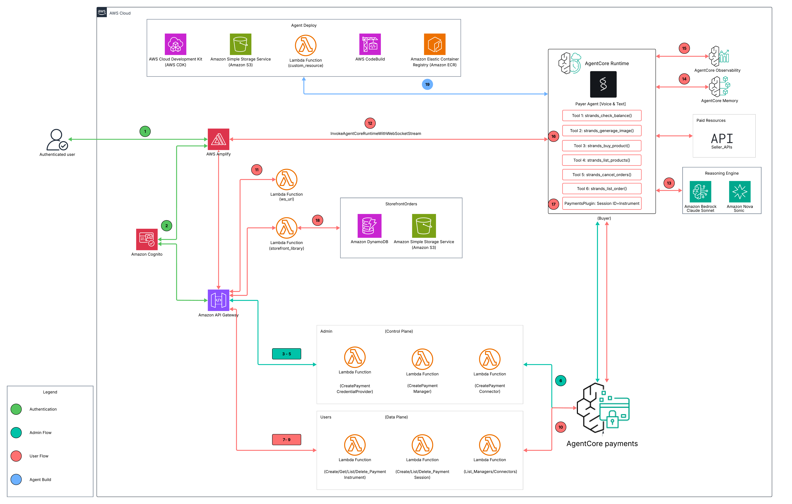
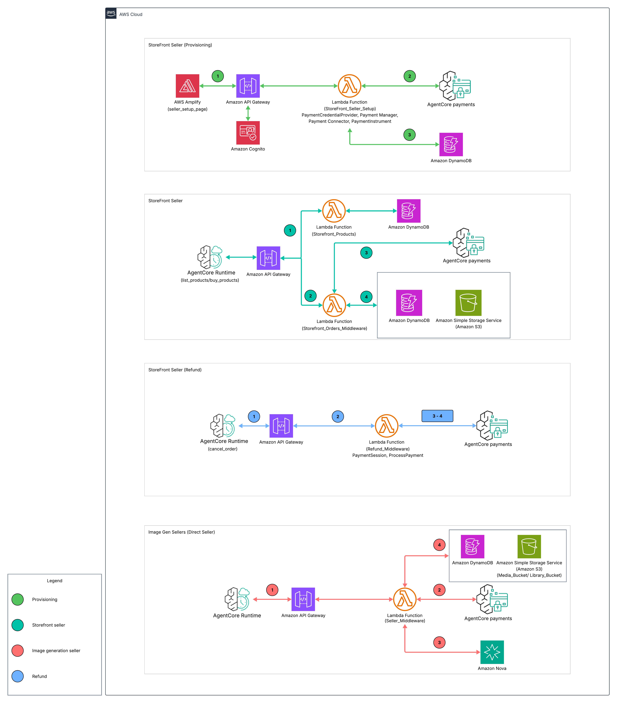

# Agentic Commerce with Amazon Bedrock AgentCore payments: Retail, Ecommerce, and Digital Assets

**Author:** Chris Wajule and Simon Goldberg

> This sample is part of the
> [AWS Digital Asset Samples](https://aws-samples.github.io/aws-digital-asset-samples/)
> collection.

> **Disclaimer:** This is a sample and reference implementation intended for demonstration, learning, and prototyping. It is not production-ready as shipped and is provided without warranty. It runs entirely on test networks (Base Sepolia and Solana Devnet) with test-only USDC and no real funds move. Before any production use you must conduct your own security, privacy, compliance, and reliability review, scope all IAM policies to least privilege for your environment, and validate the solution against your organization's requirements. Amazon Bedrock AgentCore payments is a preview capability and its APIs may change. Nothing here is legal, financial, or compliance advice.

This solution shows how to build pay-per-use AI services with [Amazon Bedrock AgentCore payments](https://aws.amazon.com/bedrock/agentcore/) and the open [x402 payment protocol](https://www.x402.org/). Users sign in through [Amazon Cognito](https://aws.amazon.com/cognito/), provision an embedded crypto wallet backed by either [Coinbase CDP](https://docs.cdp.coinbase.com/) or [Stripe/Privy](https://www.privy.io/) as the credential provider, grant the agent a scoped spending session, and then chat with a voice and text agent (Anthropic Claude Sonnet for text and [Amazon Nova Sonic](https://aws.amazon.com/ai/generative-ai/nova/) for voice, built on the [Strands Agents](https://strandsagents.com/) framework). The agent pays x402 sellers, an AI image generator powered by [Amazon Nova Canvas](https://aws.amazon.com/ai/generative-ai/nova/) and an agent-economy storefront, settling USDC on Base Sepolia or Solana Devnet through the Amazon Bedrock AgentCore payments `ProcessPayment` API, with the [x402 facilitator](https://www.x402.org/) verifying signatures and posting settlements on-chain. The `AgentCorePaymentsPlugin` is the canonical payment path: it intercepts each HTTP 402 and runs `ProcessPayment` automatically, so the agent never assembles a payment by hand. Administrators manage the AgentCore payments control plane from the included admin surface (creating and rotating credential providers, payment managers, and connectors for both vendors, and provisioning the storefront seller's payout wallet), while the storefront itself originates refunds as the payer. The patterns map directly to ecommerce, retail, and digital-asset use cases: an autonomous buyer paying per request, a storefront that sells physical and digital goods and issues refunds, and a seller that monetizes content and AI generation. Together the user surface, agent runtime, and seller endpoints provide an end-to-end reference for teams building agents that transact on behalf of users.

## Table of Contents

- [Features](#features)
- [Architecture](#architecture)
- [Architecture Details](#architecture-details)
- [Deployment](#deployment)
  - [Prerequisites](#prerequisites)
  - [Quick Start](#quick-start)
  - [Manual Installation](#manual-installation)
- [Using the Platform](#using-the-platform)
- [Development and Testing](#development-and-testing)
- [Clean Up](#clean-up)
- [Troubleshooting](#troubleshooting)

## Features

**Autonomous payments**
- `AgentCorePaymentsPlugin` as the canonical payer: it intercepts each HTTP 402, runs `ProcessPayment`, and retries with the signed proof, so the agent never assembles a payment by hand.
- End-to-end x402: 402 terms, verify, and settle through the x402 facilitator, with on-chain USDC.
- Multi-network: Base Sepolia (EVM, EIP-3009) and Solana Devnet (SPL token transfer, gasless via the facilitator feePayer).
- Payment sessions with a USDC spending limit and a 15 to 480 minute expiry that cap everything the agent can spend.

**Conversational agent**
- Text mode (Anthropic Claude Sonnet) and voice mode (Amazon Nova Sonic) over a direct WebSocket to Amazon Bedrock AgentCore Runtime, on the Strands Agents framework, with a REST `/invocations` fallback for text-only callers.
- Six tools: `check_balance`, `list_products`, `buy_product`, `generate_image`, `list_orders`, `cancel_order`.
- Streaming responses with live tool-use status and media events, a fresh AgentCore Memory session per connection, and a `context_update` message to switch instrument, session, or network without reconnecting.

**Wallets and credential providers (two vendors)**
- Coinbase CDP (email-OTP end-user UUID plus delegation) and Stripe/Privy (server-provisioned wallet plus a Connect Agent session-signer attach).
- Instrument lifecycle: create, list, get, balance (`GetPaymentInstrumentBalance`), and soft delete.
- Admin control plane for credential providers (create, rotate, delete), payment managers, and connectors, plus a one-pass Quick Setup.

**Agent-economy storefront (seller)**
- Product catalog with atomic inventory (no overselling), seeded at deploy.
- x402 orders with strict verify, reserve, settle, fulfil ordering and nonce idempotency, so goods ship only after settlement.
- Fulfilment by type: digital file (tracked, download-once, non-refundable after download), license token (HMAC-signed), and physical good (Amazon SES confirmation email with a graceful preview fallback).
- Per-buyer Library and Orders history backed by Amazon S3 and Amazon DynamoDB.
- An AgentCore-provisioned seller payout wallet shared by the storefront and the image generator.

**Image generation (seller)**
- Amazon Nova Canvas behind x402; the image returns through the gateway and the agent stores it (a 30-minute media link plus a durable library copy). The base64 never enters the model context.

**Refunds (seller as payer)**
- A consume-gated, agent-callable refund plus an admin force-refund, each through a per-refund spend-capped session, with inventory restock and library cleanup on success.

**Security and operations**
- Amazon Cognito JWT authorizer plus in-Lambda admin-group checks; the x402 proof is the seller API authentication.
- Secrets held in AWS Secrets Manager through the AgentCore Token Vault; no keys in the frontend.
- AgentCore Observability (ADOT tracing) and vended Amazon CloudWatch Logs delivery per payment manager.
- One-command deploy and teardown, including an account-scoped sweep of runtime payment resources.

## Architecture
The solution has two sides. The **buyer side** (main diagram) is an Admin Flow that configures payment infrastructure once on the control plane and a User Flow where the agent discovers and pays for services on the data plane. The **seller side** (seller diagram) provisions the storefront seller and serves paid requests: image generation, storefront orders, and refunds. Sellers are a black box in the main diagram and are broken out in the seller diagram.

### Buyer flow



The numbered steps trace each arrow in the diagram, grouped by phase.

**Authentication**

1. **Sign in (user to AWS Amplify).** The user opens the React frontend on [AWS Amplify](https://aws.amazon.com/amplify/) and starts a sign-in.
2. **Token issue (Amplify to Amazon Cognito).** Cognito authenticates the user and issues a JWT. The API client then attaches the Cognito ID token as a Bearer header on every call to [Amazon API Gateway](https://aws.amazon.com/api-gateway/), where a JWT authorizer validates it. Admin pages additionally require the `admin` group, enforced in-Lambda with `require_admin`.

**Admin setup: control plane (one-time)**

Admin requests flow from Amplify to API Gateway to the admin Lambdas, which call the Amazon Bedrock AgentCore payments control plane (`bedrock-agentcore-control`).

3. **CreatePaymentCredentialProvider (API Gateway to the credential-providers Lambda).** From the Credential Providers page (or Quick Setup), the Lambda calls `create_payment_credential_provider()`. **CoinbaseCDP** stores the CDP API key ID, API key secret, and wallet secret; **StripePrivy** stores the Privy app credentials. Vendor secrets live in [AWS Secrets Manager](https://aws.amazon.com/secrets-manager/); only the secret ARNs return to the UI, and rotation (`UpdatePaymentCredentialProvider`) preserves the provider ARN so connectors and instruments keep working.
4. **CreatePaymentManager (API Gateway to the managers Lambda).** The Lambda calls `create_payment_manager()`, backed by an IAM service role that AgentCore payments assumes to reach the Token Vault and sign payments.
5. **CreatePaymentConnector (API Gateway to the connectors Lambda).** The Lambda calls `create_payment_connector()` to bind a manager to a credential provider; the connector `type` matches the provider vendor. **Quick Setup** runs steps 3 to 5 in one pass per vendor.
6. **Control plane execution (admin Lambdas to AgentCore payments).** The `create_*` calls run against `bedrock-agentcore-control`, which provisions the credential provider, manager, and connector and stores the vendor secrets in Secrets Manager through the Token Vault.

**User setup: data plane**

User requests flow from API Gateway to the user Lambdas, which call the AgentCore payments data plane (`bedrock-agentcore`). Non-admin users discover the manager ARN and connector through the read-only `/user/payment-options` endpoint.

7. **CreatePaymentInstrument (API Gateway to the instruments Lambda).** The Instruments page calls `create_payment_instrument()` to register an embedded crypto wallet for `ETHEREUM` (Base Sepolia) or `SOLANA` (Solana Devnet), linked to the manager and connector. Coinbase instruments capture the user's CDP end-user UUID from an email OTP and forward it as the `userId`; for Privy instruments the user opens the Connect Agent page and attaches the AgentCore payments authorization-key quorum as a session signer (`addSessionSigners`) across their Privy wallets.
8. **CreatePaymentSession (API Gateway to the sessions Lambda).** The Sessions page (or New Payment Session in chat) calls `create_payment_session()` with a USDC `maxSpendAmount` and a 15 to 480 minute expiry. The session caps everything the agent can spend.
9. **Discovery (API Gateway to the payment-options Lambda).** A read-only `list_payment_managers` and `list_payment_connectors` lets non-admin users find the manager ARN and connector they need for steps 7 and 8.
10. **Data plane execution (user Lambdas to AgentCore payments).** Instrument, session, and balance calls run against `bedrock-agentcore`; the Instruments page reads live balances through `GetPaymentInstrumentBalance`.

**Conversation**

11. **WebSocket URL (Amplify to the ws_url Lambda).** The chat page requests a presigned WebSocket URL.
12. **Mint WSS (ws_url Lambda to AgentCore Runtime).** The Lambda calls `InvokeAgentRuntimeWithWebsocketStream` to mint a SigV4-signed WSS URL and returns it with the session id.
13. **Stream (Amplify to Amazon Bedrock AgentCore Runtime).** The browser connects directly over WSS and sends an init frame with the payment context (`userId`, `managerArn`, `instrumentId`, `sessionId`, `connectorId`, `network`, `mode`), then messages. The Payer Agent runs on Anthropic Claude Sonnet for text (with the `AgentCorePaymentsPlugin` attached) and Amazon Nova Sonic for voice, on Strands Agents, and selects a tool: `check_balance`, `list_products`, `buy_product`, `generate_image`, `list_orders`, or `cancel_order`. A `context_update` message can switch instrument, session, or network without reconnecting.
14. **Memory (Runtime to AgentCore Memory).** A fresh per-connection session is created in [AgentCore Memory](https://docs.aws.amazon.com/bedrock-agentcore/latest/devguide/memory-getting-started.html); the agent loads and saves conversation state there so text and voice share history.
15. **Observability (Runtime to AgentCore Observability).** ADOT auto-instrumentation emits traces and payment spans, and vended Amazon CloudWatch Logs delivery routes each payment manager's transaction logs to a log group.

**Payment**

16. **Initial x402 request (Runtime to Paid Resources).** A paid tool (`generate_image` or `buy_product`) sends its first request to the seller without a proof and receives HTTP 402 with the payment terms: price in USDC, the seller payTo address, the facilitator URL, and the supported networks.
17. **ProcessPayment and settle (Runtime to AgentCore payments).** The `AgentCorePaymentsPlugin` intercepts the 402 and calls AgentCore payments `ProcessPayment`, which signs the payload through the Token Vault (EIP-3009 for EVM, SPL token transfer for Solana) and returns a proof (`PROOF_GENERATED`). The plugin retries with the `PAYMENT-SIGNATURE` header; the seller verifies and settles through the x402 facilitator, which posts the on-chain USDC transfer.
18. **Library and orders (API Gateway to the storefront_library Lambda).** The Library and Orders pages read the buyer's purchases from the Orders table in [Amazon DynamoDB](https://aws.amazon.com/dynamodb/) (via the `buyerUserId` index) and the library bucket in [Amazon S3](https://aws.amazon.com/s3/).

**Agent build pipeline (deploy time)**

19. **Build and run (Agent Deploy to AgentCore Runtime).** AWS CDK uploads the agent source to Amazon S3; a custom-resource Lambda starts an [AWS CodeBuild](https://aws.amazon.com/codebuild/) project that builds the container image and pushes it to [Amazon Elastic Container Registry (Amazon ECR)](https://aws.amazon.com/ecr/); AgentCore Runtime runs that image.

### Seller flows



The seller diagram has four panels. Each panel's numbered flow is below.

#### Provisioning (admin, one-time)

1. **Seller Setup.** The admin Seller Setup page calls `POST /admin/storefront/seller/setup` (main Cognito API, behind `require_admin`), routing to the seller-setup Lambda.
2. **Provision AgentCore payments resources.** The Lambda calls the AgentCore payments APIs in order: `create_payment_credential_provider()` (Coinbase CDP), `create_payment_manager()` (AWS_IAM service role), `create_payment_connector()`, and `create_payment_instrument()` twice, one Base Sepolia and one Solana Devnet payout instrument, both scoped to the seller service `userId`.
3. **Persist config.** The Lambda writes the seller config (manager, connector, credential-provider ids, both payout addresses, status `READY`) to Amazon DynamoDB and returns the Coinbase Wallet Hub delegation links plus a one-time Solana USDC funding note. The image generator and the storefront both read their payout address from this single config.

#### Storefront seller (purchase)

1. **Browse.** `list_products` calls `GET /products` → the products Lambda → the catalog in Amazon DynamoDB (free, no payment).
2. **Order and 402.** `buy_product` calls `POST /orders` without a proof → the orders Lambda returns HTTP 402 with the payTo from the seller config.
3. **Pay.** The `AgentCorePaymentsPlugin` runs `ProcessPayment` from the buyer's session and retries `/orders` with the proof.
4. **Verify, settle, fulfil.** The orders Lambda runs the order in strict order: verify the proof, reserve inventory atomically in DynamoDB, settle through the x402 facilitator, then fulfil by type: a digital file copied to the Amazon S3 library bucket (tracked download), a signed license token, or a physical-order email, then mark the order `CONFIRMED`. Goods are delivered only after settlement succeeds.

#### Image generation seller

1. **Request and 402.** `generate_image` calls `POST /image-gen` without a proof → the image-gen Lambda reads its payout address from the seller config (DynamoDB) and returns HTTP 402.
2. **Pay.** The plugin runs `ProcessPayment` from the buyer's session and retries with the proof.
3. **Generate.** On settlement the Lambda calls Amazon Bedrock (Nova Canvas) to render the PNG and returns it as base64 through API Gateway to AgentCore Runtime.
4. **Store and deliver.** The agent runtime uploads the image to the Amazon S3 media bucket (a 30-minute presigned link) and a durable copy to the per-buyer library bucket, then sends a media event to the frontend. The base64 never enters the model context.

#### Refund (seller as payer)

1. **Find and initiate.** When the buyer lacks the order id, the agent looks it up with `list_orders` (a buyer-scoped `GET /orders?userId=` lookup via the `buyerUserId` index), confirms the match, then `cancel_order` calls `POST /orders/{id}/refund` (consume-gated, so a downloaded item is non-refundable and the agent cannot force it; an admin can force via `POST /admin/storefront/orders/{id}/refund` from the Seller Orders page).
2. **Capped session.** The orders Lambda's `refundOrder` calls `settlePayout`, which creates a per-refund payment session capped at exactly the refund amount, scoped to the seller `userId`.
3. **Pay the buyer.** It calls `ProcessPayment` with the seller's instrument for the order's network as the payer, then settles seller→buyer through the x402 facilitator.
4. **Finalize.** On a successful settle the order is marked `REFUNDED`, inventory is restocked, and the buyer's library copy is removed.

## Architecture Details

### Payment Flow

Every paid action converges on the AgentCore payments `ProcessPayment` call, driven by the `AgentCorePaymentsPlugin`.

| Path | Tool | Price | How it works |
|------|------|-------|--------------|
| Image generation | `generate_image` | 0.04 USDC | The seller Lambda returns HTTP 402; the plugin runs `ProcessPayment` and retries with the proof; the seller settles and renders the image with Amazon Nova Canvas |
| Storefront order | `buy_product` | per product | The storefront returns HTTP 402; the plugin pays; the order Lambda verifies, reserves inventory, settles, and fulfils |
| Refund | `cancel_order` | reverse | The order Lambda creates a per-refund spend-capped session and calls `ProcessPayment` with the seller as the payer, settling USDC back to the buyer |
| Balance | `check_balance` | free | `GetPaymentInstrumentBalance` on the active instrument; no payment |
| Order lookup | `list_orders` | free | Buyer-scoped `GET /orders?userId=` on the storefront (via the `buyerUserId` index); lets the agent find an order id to refund across sessions |

**Canonical plugin path:** In text and REST modes the `AgentCorePaymentsPlugin` is attached to the agent. A paid tool issues its first request with no proof; on an HTTP 402 it returns a `PAYMENT_REQUIRED` marker that the plugin intercepts, running the tagged `ProcessPayment` and retrying the tool with the `PAYMENT-SIGNATURE` header injected. The agent never assembles a payment by hand, and the base64 image never enters the model context. Voice mode (`BidiAgent`) uses an equivalent in-tool pay-and-retry fallback. Both paths call the same `ProcessPayment` with the session ID, instrument ID, the payment requirements from the 402, and the vendor-matched `userId`.

### Payment Context

Payment credentials (manager ARN, instrument ID, session ID, wallet address, network, and the vendor-matched `userId`) are threaded to the agent per session through the WebSocket init frame (or the REST body), so the agent does not read a database at connection time. The agent injects them into the tool layer through `set_payment_credentials()`. For Coinbase instruments the CDP UUID is the effective `userId`; for Stripe/Privy instruments the Cognito sub is used. The network field (`ETHEREUM` or `SOLANA`) selects the x402 scheme and the balance lookup. A `context_update` message lets the frontend switch instrument, session, or network without reconnecting.

### Voice and Text Modes

| Mode | Model | Payment path |
|------|-------|--------------|
| Text | Anthropic Claude Sonnet (`us.anthropic.claude-sonnet-4-6`) via Strands Agents | `AgentCorePaymentsPlugin` (canonical) |
| Voice | Amazon Nova Sonic (`amazon.nova-2-sonic-v1:0`) via `BidiAgent` | in-tool pay-and-retry fallback |

Both modes share the same tools and payment infrastructure. [AgentCore Memory](https://docs.aws.amazon.com/bedrock-agentcore/latest/devguide/memory-getting-started.html) persists conversation across sessions.

### Seller Lambdas

The x402-enabled seller endpoints run as Lambda functions behind their own API Gateways. The x402 payment proof is the authentication, so no Cognito is required. Both accept Base Sepolia and Solana Devnet and resolve their payout address from the provisioned seller config.

| Endpoint | Function | Price | Response |
|----------|----------|-------|----------|
| `POST /image-gen` | AI image generation via Amazon Nova Canvas | 0.04 USDC | Base64-encoded PNG, returned to the agent, which stores it in Amazon S3 |
| `POST /orders` | Agent-economy storefront order (verify → reserve inventory → settle → fulfil) | per product | Order confirmation; digital file/license or physical-order email |
| `GET /products` | Storefront catalog (free, no payment) | n/a | Product list/detail from Amazon DynamoDB |

The storefront also exposes `POST /orders/{id}/refund` (consume-gated, agent-callable) and, on the main authenticated API, an admin force-refund. A refund makes the seller the payer through a per-refund spend-capped session.

## Deployment

### Prerequisites

1. AWS account with appropriate permissions
2. Node.js 18.x or later
3. AWS CDK CLI, pinned (`npm install -g aws-cdk@2.1128.1`)
4. AWS CLI configured with credentials
5. Python 3.12 (for local agent development)
6. A wallet provider account: Coinbase CDP or Stripe via Privy. See [Obtaining Wallet Provider Credentials](docs/credentials.md) for step-by-step instructions and links.
7. USDC on Base Sepolia or Solana Devnet for testing, from the [Circle Faucet](https://faucet.circle.com/)
8. Bash shell (Windows: use WSL or Git Bash)

### Quick Start

The setup scripts handle everything from a clean clone: `.env` creation, dependency installation, CDK bootstrap, deployment, and automatic `.env` injection of stack outputs.

Move into the project directory:

```bash
cd agentcore-payments
```

Create your `.env` from the template:

```bash
cp .env-sample .env
```

Optional: if you plan to use Stripe/Privy wallets, open `.env` and fill in the two public Privy IDs (`VITE_PRIVY_APP_ID` and `VITE_PRIVY_SIGNER_ID`) from the [Privy Dashboard](https://dashboard.privy.io). These are the only values you set by hand; everything else is auto-detected or injected by the setup scripts. You can skip this and add them later if you are only using Coinbase CDP. See [Obtaining Wallet Provider Credentials](docs/credentials.md) for where to find them.

Deploy the backend (installs dependencies, deploys the CDK stack, and injects outputs):

```bash
npm run setup:backend
```

Deploy the frontend:

```bash
npm run setup:amplify
```

There is no seller wallet to set in `.env`. The seller's payout wallet (EVM and
Solana) is provisioned by AgentCore payments from the admin Seller Setup page
after deploy, and every paid endpoint (storefront orders and the image-gen
seller) receives payments to that one provisioned wallet.

`setup:backend`:
1. Copies `.env-sample` → `.env` if missing.
2. Detects `AWS_ACCOUNT_ID` and `AWS_REGION` from your CLI config.
3. Installs all npm dependencies (backend CDK and seller Lambdas).
4. Bootstraps CDK.
5. Deploys the CDK stack.
6. Injects stack outputs (`COGNITO_USER_POOL_ID`, `API_URL`, `SELLER_API_URL`, `MEMORY_ID`, and their `VITE_`-prefixed counterparts) into `.env`.

`setup:amplify`:
1. Builds the React frontend with the injected env vars.
2. Creates an Amplify app on first run or reuses the existing one on subsequent runs.
3. Deploys the build artifacts and saves `AMPLIFY_APP_ID` to `.env`.

Re-running `setup:amplify` updates the same deployment; it never creates duplicates.

#### Optional: Enable Privy Add Signer on the Frontend

StripePrivy-backed wallets require attaching the AgentCore authorization-key quorum as a session signer before `ProcessPayment` can sign on the user's behalf. The Instruments page exposes an **Add Signer** action per Privy instrument that runs a one-time [Privy email OTP](https://docs.privy.io/authentication/user-authentication/overview) and then calls `addSessionSigners`. To enable the flow, set two public values in `.env`:

| Variable | Source |
|----------|--------|
| `VITE_PRIVY_APP_ID` | [Privy Dashboard](https://dashboard.privy.io) → App → App ID |
| `VITE_PRIVY_SIGNER_ID` | Privy Dashboard → Wallet infrastructure → Authorization keys → key ID |

Both values are public identifiers; the private key and app secret stay on the backend and are entered directly in the admin surface (Credential Providers page).

> **Important — the signer and the credential provider must use the same authorization key.** `VITE_PRIVY_SIGNER_ID` must be the **same** Privy authorization key whose private key you later paste as the Credential Provider's **Authorization Private Key** — i.e. the credential provider's **Authorization Key ID** must equal `VITE_PRIVY_SIGNER_ID`. The Add Signer flow grants your wallet delegation to `VITE_PRIVY_SIGNER_ID`, and the agent signs with the credential provider's key; if they are different keys, `ProcessPayment` will be rejected by Privy at signing time even though everything appears configured.

### Manual Installation

If you prefer to deploy step by step:

#### Step 1: Configure Environment

```bash
cp .env-sample .env
```

The setup script auto-detects or injects every value; there is nothing to fill
in manually. The seller payout wallet is provisioned later from the admin Seller
Setup page, not set here.

| Variable | Required | Source |
|----------|----------|--------|
| `AWS_REGION` | No | AWS CLI config |
| `AWS_ACCOUNT_ID` | No | `aws sts get-caller-identity` |
| `CP_ENDPOINT` / `DP_ENDPOINT` | No | Derived from `AWS_REGION` |
| `COGNITO_USER_POOL_ID` | No | Injected by `setup:backend` |
| `COGNITO_CLIENT_ID` | No | Injected by `setup:backend` |
| `API_URL` | No | Injected by `setup:backend` |
| `SELLER_API_URL` | No | Injected by `setup:backend` |
| `MEMORY_ID` | No | Injected by `setup:backend` |
| `VITE_PRIVY_APP_ID` | No | Privy Dashboard (only needed for StripePrivy Add Signer flow) |
| `VITE_PRIVY_SIGNER_ID` | No | Privy Dashboard (only needed for StripePrivy Add Signer flow) |

After deploy, run Seller Setup from the admin page to provision the seller
payout wallet. The setup page surfaces the Solana payout address with funding
guidance: fund it once with USDC on Solana Devnet through the
[Circle Faucet](https://faucet.circle.com/) so its token account exists, which
the x402 facilitator needs to settle Solana payments. EVM needs no such step.

#### Step 2: Install Dependencies

Install the backend (CDK) dependencies:

```bash
cd backend && npm ci && cd ..
```

Install the image generation seller dependencies:

```bash
cd backend/lambdas/sellers/image-gen && npm ci && cd ../../../..
```

Install the storefront seller dependencies:

```bash
cd backend/lambdas/sellers/storefront && npm ci && cd ../../../..
```

Install the frontend dependencies:

```bash
cd frontend && npm ci && cd ..
```

#### Step 3: Deploy Backend Stack

Bootstrap CDK (first time per account and Region):

```bash
cd backend && npm run cdk -- bootstrap "aws://$AWS_ACCOUNT_ID/$AWS_REGION"
```

Deploy the stack:

```bash
npm run cdk -- deploy --require-approval never --outputs-file ../cdk-outputs.json
```

Copy the values from `cdk-outputs.json` into `.env`, or run `setup:backend`, which does this automatically.

#### Step 4: Deploy Frontend

```bash
npm run setup:amplify
```

Or run the frontend locally:

```bash
cd frontend && npm run dev
```

## Using the Platform

### Initial Setup (Admin)

1. **Sign in as an admin.** `setup:backend` seeds a demo admin user (`demo@agentcore-payments.dev`) in the `admin` group, so you can reach the admin pages immediately. The password is generated once during deployment and stored in AWS Secrets Manager (never in this repo, logs, or stack outputs). Retrieve it using the secret name from the `AdminCredentialsSecretName` stack output, which `setup:backend` also injects into `.env` as `ADMIN_SECRET_NAME`:

   ```bash
   aws secretsmanager get-secret-value --secret-id "$ADMIN_SECRET_NAME" --query SecretString --output text
   ```

   Rotate or remove this demo account before any real exposure. Otherwise, sign up your own account (the first user is auto-assigned to the `user` group) and add it to the `admin` group in the [Cognito console](https://console.aws.amazon.com/cognito/).

2. **Quick Setup (recommended):** From the Admin > Overview page, click **Quick Setup** and pick a vendor tab (Coinbase CDP or Stripe/Privy). Fill in the vendor credentials and a manager and connector name. The UI runs all three create calls in order. See [Obtaining Wallet Provider Credentials](docs/credentials.md) for how to get each vendor's values.

3. **Manual setup** (for finer control or adding a second vendor):
   - **Credential Provider:** Admin > Credential Providers > Create. Coinbase CDP takes the API Key ID, API Key Secret, and Wallet Secret. Stripe/Privy takes the App ID, App Secret, Authorization Key ID, and P256 Authorization Private Key.
   - **Payment Manager:** Admin > Payment Managers > Create. Only a name and optional description are required; the IAM role is provisioned by the stack.
   - **Payment Connector:** Admin > Payment Connectors > Create. Pick the manager and credential provider; the `type` is inferred from the provider vendor.

4. **Editing and rotating:**
   - Payment Managers and Payment Connectors support editing the description after creation. Names and ARNs are immutable by the service.
   - Credential Providers support credential rotation through the Edit action. `UpdatePaymentCredentialProvider` is a full replace of `providerConfigurationInput`, so the dialog resubmits the full secret set for the chosen vendor. The provider ARN stays the same, so connectors and instruments continue to work without migration.

### Using the Agent (User)

1. **Create an Instrument:** Navigate to Instruments. Pick a network (`ETHEREUM` for Base Sepolia or `SOLANA` for Solana Devnet), select a connector, and click Create.
   - **Coinbase CDP instruments:** The page prompts for a Coinbase email OTP to capture your CDP end-user UUID. The wallet, delegation, and all downstream calls address the same CDP user.
   - **Stripe/Privy instruments:** AgentCore provisions the wallet server-side. Click **Add Signer** on the instrument row to attach the agent's authorization-key quorum through a one-time Privy email OTP. The row displays **Signer ✓** once attached. See the [Privy add-signers docs](https://docs.privy.io/wallets/using-wallets/signers/add-signers) for the underlying flow.

2. **Grant signing permission (Coinbase only):** Click **Grant Delegation** on the Instruments page to authorize AgentCore to sign x402 payments on your behalf for 24 hours. Revoke at any time.

3. **Create a Payment Session:** In the Agent Chat page, click **New Payment Session**. Set a spending limit (for example, 1.0 USD) and expiry (15 to 480 minutes). Sessions are network-agnostic, so the same session works with any instrument under the selected payment manager.

4. **Select your wallet** from the dropdown in the chat header. The network is detected from the instrument.

5. **Fund your wallet** with USDC from the [Circle Faucet](https://faucet.circle.com/): pick Base Sepolia for EVM instruments or Solana Devnet for Solana instruments.

6. **Connect:** Click **Text** for text mode or **Voice** for voice mode.

7. **Chat with the agent:**
   - Image generation: "Generate an image of a sunset over mountains"
   - Browse the storefront: "What's for sale?"
   - Buy a product: "Buy the stock photo pack"
   - Cancel and refund: "Cancel my last order"
   - Wallet balance: "What's my wallet balance?"

### Example Conversation

```
User: What's my wallet balance?
Agent: [check_balance]
       Your wallet has 4.85 USDC on Base Sepolia.

User: What's for sale?
Agent: [list_products]
       Here is each product with its price, stock, and description...

User: Buy the stock photo pack
Agent: [buy_product]
       Your Stock Photo Pack purchase is confirmed, 7.99 USDC on Solana Devnet.
       It's available in your Library.

User: Generate an image of a whale swimming in space
Agent: [generate_image]
       Your image is ready, 0.04 USDC. It's shown here and saved to your Library.

User: Cancel that order
Agent: [cancel_order]
       The order was cancelled and 7.99 USDC was refunded to your wallet.

User: (new session) Actually, refund the stock photo pack I bought earlier
Agent: [list_orders]
       I found your Stock Photo Pack order for 7.99 USDC on Solana Devnet.
       [cancel_order]
       Done, 7.99 USDC was refunded to your wallet.
```

## Development and Testing

### Local Agent Development

Install dependencies:

```bash
cd payment-agent && pip install -r requirements.txt
```

Run the agent:

```bash
python agent.py
```

The agent runs on port 8080 with `/ping`, `/health`, `/invocations` (REST), and `/ws` (WebSocket) endpoints.

```bash
curl -X POST http://localhost:8080/invocations \
  -H "Content-Type: application/json" \
  -d '{"prompt": "What is for sale in the storefront?", "userId": "test-user"}'
```

### Frontend Development

Install dependencies and start the dev server:

```bash
cd frontend && npm ci && npm run dev
```

Build for production:

```bash
npm run build
```

The React frontend uses [Vite](https://vite.dev/) and connects to the API Gateway URL in `VITE_API_URL`.

### CDK Development

Install dependencies:

```bash
cd backend && npm ci
```

Synthesize the CloudFormation template:

```bash
npm run cdk -- synth
```

Preview changes against the deployed stack:

```bash
npm run cdk -- diff
```

Deploy:

```bash
npm run cdk -- deploy
```

### Project Structure

```
agentcore-payments/
├── payment-agent/              # Agent container (deployed to AgentCore Runtime)
│   ├── agent.py                # FastAPI server, text/voice streaming, WebSocket handler
│   ├── tools.py                # check_balance, generate_image, list_products, buy_product,
│   │                           #   list_orders, cancel_order; x402 + AgentCore payments ProcessPayment
│   ├── config.py               # Centralized environment configuration
│   ├── Dockerfile              # Python 3.12 slim container
│   └── requirements.txt        # strands-agents, bedrock-agentcore (Payments plugin), fastapi, boto3
├── backend/
│   ├── lib/
│   │   └── payment-agent-stack.ts  # CDK stack (Cognito, DynamoDB, Lambda, API GW, ECR,
│   │                               #   CodeBuild, AgentCore Runtime + Memory, S3)
│   └── lambdas/
│       ├── admin/              # Credential providers, payment managers, payment connectors
│       ├── user/               # Instruments, sessions, payment options, agent WebSocket URL
│       ├── sellers/
│       │   ├── image-gen/      # x402 seller: Nova Canvas image generation (0.04 USDC)
│       │   └── storefront/     # x402 agent-economy storefront: products, orders (x402 +
│       │                       #   refunds), seller setup, library; deliverables + static site
│       └── shared/             # AgentCore payments client, response helpers
├── frontend/
│   └── src/
│       ├── pages/
│       │   ├── admin/          # Overview, credential providers, managers, connectors,
│       │   │                   #   seller setup, seller orders, how it works
│       │   └── user/           # Connect agent, agent chat, instruments, sessions,
│       │                       #   orders, library, information
│       ├── components/         # Reusable UI components
│       ├── providers/          # PrivyProvider (Privy embedded wallets)
│       └── lib/                # API client, auth, balance utilities
├── test/integration/          # setup_backend.sh, setup_amplify.sh, cleanup.sh,
│                              #   delete_payment_resources.py
├── .env-sample                 # Environment variable template
├── package.json                # Top-level scripts (setup, cleanup)
└── amplify.yml                 # AWS Amplify build configuration
```

## Clean Up

### Automated Cleanup

```bash
npm run cleanup
```

This deletes the Amplify app (from the saved `AMPLIFY_APP_ID`), runs an account-scoped teardown of the runtime AgentCore payments resources created via the admin console and Seller Setup (managers, connectors, credential providers, instruments, sessions), destroys the CDK stack, removes CloudWatch log groups, cleans the Amazon ECR repository, and deletes local build artifacts. It prompts for confirmation, with a separate confirmation for the account-wide payment resource sweep (skip that step if you run cleanup in a shared account).

### Manual Cleanup

Delete resources in reverse order of creation.

**1. Delete the Amplify app:**

```bash
APP_ID=$(aws amplify list-apps --query "apps[?name=='agentcore-payments'].appId" --output text)
aws amplify delete-app --app-id $APP_ID
```

**2. Delete the runtime AgentCore payments resources** (managers, connectors, credential providers, instruments, sessions) created via the admin console and Seller Setup. These are not part of the CDK stack, so do this before destroying the stack:

```bash
python3 test/integration/delete_payment_resources.py --yes
```

**3. Destroy the CDK stack:**

```bash
cd backend && npm run cdk -- destroy --force && cd ..
```

**4. Delete CloudWatch log groups:**

```bash
for prefix in "/aws/lambda/agentcore-payments" "/aws/lambda/x402-seller" "/aws/lambda/x402-storefront" "/aws/codebuild/agentcore-payments" "/aws/bedrock-agentcore/runtimes"; do
  aws logs describe-log-groups --log-group-name-prefix "$prefix" \
    --query 'logGroups[*].logGroupName' --output text | \
    xargs -n1 aws logs delete-log-group --log-group-name 2>/dev/null
done
```

**5. Delete ECR images:**

```bash
aws ecr delete-repository --repository-name agentcore-payments-agent --force
```

**6. Remove local files:**

```bash
rm -rf backend/node_modules/ backend/cdk.out/ frontend/node_modules/ frontend/dist/
```

## Troubleshooting

| Issue | Cause | Solution |
|-------|-------|----------|
| `401 Unauthorized` on API calls | Cognito token expired or missing | Log out and log back in; verify `VITE_COGNITO_USER_POOL_ID` and `VITE_COGNITO_CLIENT_ID` match CDK outputs |
| `403 Forbidden` on admin routes | User not in `admin` group | Add the user to the `admin` group in the Cognito console |
| `Payment session expired` | Session exceeded its expiry | Create a new session (15–480 minutes) |
| `Insufficient balance` | Session spending limit reached | Create a new session with a higher USDC spending limit |
| `Payment instrument not found` on Coinbase | Instrument created before the CDP UUID identity fix, or a stale session created under a different identity | Recreate the Coinbase instrument and create a fresh session |
| `ProcessPayment` succeeds but transfer fails on Privy | Authorization-key quorum is not attached as a signer on the wallet | Click **Add Signer** on the Privy instrument row and complete the Privy email OTP |
| Solana payments fail with empty `{}` error | The provisioned seller wallet has no USDC token account on devnet | Fund the seller's Solana payout address (shown on the admin Seller Setup page) with USDC through the [Circle Faucet](https://faucet.circle.com/) on Solana Devnet |
| Solana payments fail, wrong network selected | Agent picks EVM accept instead of Solana | Rebuild the agent container (`npm run setup:backend`). The seller session registers only the user's active network |
| Agent not responding | AgentCore Runtime not deployed or unhealthy | Check that `AgentRuntimeArn` exists; verify the CodeBuild project succeeded |
| Images not displaying | S3 presigned URL expired or media bucket missing | URLs expire after 30 minutes; verify `MEDIA_BUCKET` on the Runtime |
| Voice mode no audio | Nova Sonic not enabled | Enable `amazon.nova-2-sonic-v1:0` in the [Bedrock console](https://console.aws.amazon.com/bedrock/) for your region |
| WebSocket disconnects on large responses | 128 KB frame limit | Large responses chunk automatically; this is an API Gateway limit |
| CDK deploy fails on CodeBuild | Docker not available or ECR permissions missing | Ensure the CodeBuild project has `privileged: true` and ECR push permissions |
| `ModuleNotFoundError` in agent | Missing dependency in container | Verify `requirements.txt` includes all packages; redeploy through `cdk deploy` |

## Security

- Wallet private keys are stored in AWS Secrets Manager through the AgentCore Token Vault and never reach the agent or frontend.
- API routes are protected by Cognito JWT authorization.
- Seller endpoints use x402 payment proofs as authentication; no API keys needed.
- The S3 media bucket blocks public access; content is served through time-limited presigned URLs.
- Payment sessions have configurable spending limits and expiry durations that limit exposure.
- For Coinbase-backed wallets, AgentCore signs on the user's behalf only while the user's CDP delegation is active, scoped to 24 hours by default and revocable at any time.
- For Privy-backed wallets, the agent signs through the authorization-key quorum attached through **Add Signer**. Signer attachment is one-time per wallet and revocable through the Privy dashboard.
- The seeded demo admin password is generated at deployment and stored in AWS Secrets Manager, not in this repository. Retrieve it from Secrets Manager (see [Using the Platform](#using-the-platform)) and rotate or remove the account before any real exposure.

### Infrastructure scanning (cdk-nag)

The CDK app runs [cdk-nag](https://github.com/cdklabs/cdk-nag) `AwsSolutionsChecks` on every synth and deploy, so infrastructure is linted against the AWS Solutions rule pack. Genuine improvements are applied in the stack (S3 `enforceSSL`, DynamoDB point-in-time recovery, and CloudFront origin access control). The remaining findings are intentional sample trade-offs (for example, x402 seller APIs use payment proofs instead of a JWT authorizer, and AgentCore payments preview actions are not yet resource-scopeable) and carry inline `NagSuppressions` with a documented reason for each. Run `CDK_NAG=0 npm run cdk -- synth` to skip the checks during fast local iteration.

### Responsible AI

This sample runs a conversational agent that can take actions on a user's behalf, including test-network payments. It is built with responsible AI safeguards, and you should extend them for production:

- Bounded authority. The agent can only spend within an explicit payment session that carries a user-set USDC spending limit and a 15 to 480 minute expiry. It cannot exceed the limit or act after expiry, and the session is created by the user, not the model.
- Scoped identity. Each paid action is bound to the user's own instrument and vendor-matched `userId`, injected server-side into the tool layer. The model does not choose whose funds to spend.
- Test-only funds. All payments settle in test-network USDC (Base Sepolia, Solana Devnet). No real money moves.
- Human in the loop. The user initiates each conversation, sees live tool-use status for every action (browsing, purchasing, refunding), and can stop at any time. Refunds of real value should keep an explicit human approval step.
- Managed models. All model access is through Amazon Bedrock (Anthropic Claude Sonnet for text, Amazon Nova Sonic for voice, Amazon Nova Canvas for images). For production, configure [Amazon Bedrock Guardrails](https://aws.amazon.com/bedrock/guardrails/) for content filtering and denied topics, add validation of tool inputs and model outputs, and log agent decisions for auditability.
- Transparency. The agent identifies itself as an AI assistant and does not impersonate a human.

Deploying an autonomous agent that transacts on a user's behalf is a high-responsibility use case. Review the [AWS Responsible AI](https://aws.amazon.com/machine-learning/responsible-ai/) guidance and apply controls appropriate to your risk tolerance before moving beyond test networks.

### Compliance

This sample does not process or store cardholder data. Payments are settled in stablecoin (USDC) over the x402 protocol using wallet signatures, and Stripe/Privy is used here as a wallet credential provider, not as a card processor, so PCI-DSS does not apply to this implementation. If you extend this solution to accept card payments, you become responsible for PCI-DSS compliance; see the [AWS PCI-DSS compliance resources](https://aws.amazon.com/compliance/pci-dss-level-1-faqs/) for guidance. Nothing here is legal or compliance advice.

## License

This library is licensed under the MIT-0 License. See the LICENSE file.
