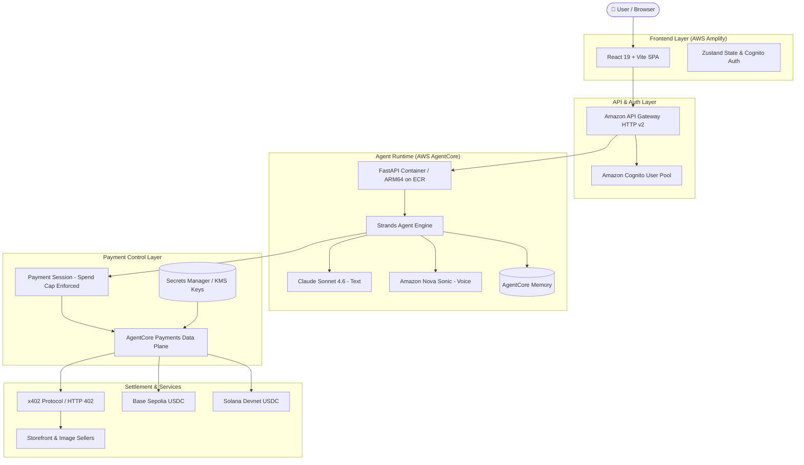

# ⚡ Nexus Pay

### AI-powered Web3 payments with programmable financial control.

> **Let AI handle payments. Never let AI have uncontrolled access to your money.**

Nexus Pay is a permission and financial execution layer for autonomous AI agents. Built on **AWS AgentCore Payments**, the **x402 protocol**, and **testnet USDC**, Nexus Pay allows users to interact with an AI payment agent while retaining strict, cloud-enforced control over spending limits, session durations, and wallet credentials!

---

<p align="center">
  
  
  
  
  
  
</p>

---

## 📌 Quick Navigation

| Resource | Link | Description |
|---|---|---|
| 🚀 **Live Demo** | `Coming soon` | Live web application instance |
| 🎥 **Demo Video** | `Coming soon` | 3-minute video walkthrough |
| 📖 **Technical Architecture** | [docs/architecture.md](docs/architecture.md) | Deep-dive system design & data flow |
| 🚀 **Deployment Guide** | [docs/deployment.md](docs/deployment.md) | Step-by-step AWS & frontend setup |
| 🧪 **QA & Audit Report** | [docs/QA.md](docs/QA.md) | Full static analysis & build verification report |
| 🔑 **Credential Guide** | [docs/credentials.md](docs/credentials.md) | Coinbase CDP & Stripe/Privy setup instructions |
| 📄 **Submission Docs** | [docs/submission/](docs/submission/) | Hackathon problem, solution, innovation & AWS docs |

---

## 🤖 The Problem

AI agents are rapidly evolving from passive chatbots into autonomous operational actors. Modern agents can browse the web, interact with APIs, organize workflows, and perform complex tasks over extended periods.

However, **financial autonomy introduces a severe security and trust risk**:

```text
❌ TRADITIONAL APPROACH A (Manual Approval):
AI Agent → Needs Payment → Asks User for Approval → User Manually Pays → Breaks Automation

❌ TRADITIONAL APPROACH B (Unrestricted Wallet Access):
AI Agent → Full Private Key / Wallet Access → Risk of Overspending, Prompt Injections & Drained Funds
```

> **The Central Challenge**: How do we give AI agents the financial capability to pay for API credits, data feeds, and web services autonomously — without giving them unrestricted access to a user's wallet?

---

## 🔐 The Nexus Pay Approach

Nexus Pay introduces a **programmable permission and execution layer** that sits between the AI agent and the payment infrastructure.

```text
┌──────────────┐     defines constraints     ┌────────────────────────┐
│     User     │ ──────────────────────────> │    Payment Session     │
└──────┬───────┘                             │  (Max Spend & Expiry)  │
       │                                     └───────────┬────────────┘
       │ natural language request                        │
       ▼                                                 │ cloud enforcement
┌──────────────┐      requests payment       ┌───────────▼────────────┐     ProcessPayment     ┌──────────────┐
│  Nexus AI    │ ──────────────────────────> │   Nexus Pay Control    │ ─────────────────────> │  AgentCore   │
│    Agent     │                             │        Layer           │                        │   Payments   │
└──────────────┘                             └────────────────────────┘                        └──────┬───────┘
                                                                                                      │
                                                                                                      ▼
                                                                                               ┌──────────────┐
                                                                                               │ x402 / USDC  │
                                                                                               │  Settlement  │
                                                                                               └──────────────┘
```

### Core Product Philosophy

> **AI autonomy without unrestricted financial authority.**

1. **Session-Bound Budgets**: Users create a time-bound Payment Session specifying a hard spend limit (e.g., `5.00 USDC` max for 60 minutes).
2. **Keyless Agent Architecture**: The AI agent never holds raw private keys or seed phrases. Signing credentials reside securely in AWS Secrets Manager under KMS encryption.
3. **Cloud-Level Enforcement**: Spending limits are enforced at the AWS AgentCore infrastructure level — an agent cannot bypass its budget even if manipulated by a prompt injection attack.
4. **Autonomous x402 Execution**: When an API returns `HTTP 402 Payment Required`, the agent evaluates requirements, executes payment within session bounds, and continues the task uninterrupted.

---

## 💳 How a Payment Works

```text
1. 👤 User: "Buy the API Credit Pack for my research task."
2. 🤖 AI Agent: Interprets request and queries storefront via tool call.
3. 🌐 Storefront: Responds with HTTP 402 Payment Required (x402 header).
4. 🔐 Nexus Control: Validates payment amount against remaining PaymentSession budget.
5. ⚡ AgentCore Payments: Signs & processes payment (CRYPTO_X402) cloud-side.
6. 💵 Settlement: Testnet USDC settles on Base Sepolia or Solana Devnet.
7. ✅ Service Delivered: Storefront verifies proof; agent receives item & confirms to user.
```

---

## ⚡ Powered by x402

The [x402 protocol](https://x402.org) enables APIs and web services to declare payment requirements directly over standard HTTP status codes:

```text
Nexus AI Agent               Storefront / Seller API            AgentCore Payments
      │                                 │                               │
      │ ─── 1. POST /orders ──────────> │                               │
      │ <── 2. HTTP 402 + x402 Header ── │                               │
      │                                 │                               │
      │ ─── 3. Validate Session Cap & ProcessPayment ─────────────────> │
      │ <── 4. Signed X-PAYMENT Proof ───────────────────────────────── │
      │                                 │                               │
      │ ─── 5. POST /orders (X-PAYMENT)─> │                               │
      │ <── 6. 200 OK + Product Delivery│                               │
```

Nexus Pay integrates x402 natively inside the agent's tool execution loop. Payment requirements are detected, validated, signed, and retried automatically within milliseconds.

---

## 🛍️ Example Payment Flow

Here is a step-by-step trace of an example Nexus Pay transaction (using testnet USDC on Base Sepolia):

```text
User Input:
"Generate a cyberpunk futuristic logo and pay for high-resolution download."

        ↓

1. AI Agent selects `generate_image` tool (cost: 0.04 USDC).

        ↓

2. Image Seller Service responds: HTTP 402 Payment Required.

        ↓

3. Nexus Pay interceptor checks session budget:
   (0.04 USDC ≤ 5.00 USDC remaining cap? YES)

        ↓

4. AgentCore Payments signs `CRYPTO_X402` payload on Base Sepolia.

        ↓

5. Image Seller verifies proof → generates image via Amazon Nova Canvas → returns presigned S3 link.

        ↓

6. Agent delivers image to chat; purchase recorded in user's Library & Orders history.
```

*> Note: The transaction flow above is source-verified in `tools.py` and `agent.py`. Live execution occurs on testnet USDC when deployed to AWS.*

---

## 📊 Implemented vs. Future Capabilities

We believe in complete transparency. Here is the exact status of capabilities in the repository:

### ✅ Currently Implemented

| Capability | Status | Details |
|---|:---:|---|
| 🤖 **AI Payment Agent (Text)** | ✅ | Strands-based AI agent powered by Claude Sonnet 4.6 via AgentCore Runtime |
| 🎙️ **AI Payment Agent (Voice)** | ✅ | Real-time speech-to-speech interaction via Amazon Nova Sonic (`BidiAgent`) |
| 🔐 **Session Spending Caps** | ✅ | Enforced cloud-side via `PaymentSession.limits.maxSpendAmount` |
| ⏳ **Session Expiration** | ✅ | Time-bound authorization windows enforced by AgentCore |
| 👛 **Payment Instruments** | ✅ | Embedded USDC wallets on Base Sepolia (EVM) & Solana Devnet (SVM) |
| ⚡ **x402 Auto-Payment Flow** | ✅ | `AgentCorePaymentsPlugin` intercepts HTTP 402, signs proof & retries |
| 💵 **Testnet USDC Settlement** | ✅ | On-chain settlement on Base Sepolia & Solana Devnet |
| 📊 **Balance Checking** | ✅ | Real-time on-chain USDC balance via `GetPaymentInstrumentBalance` |
| 🛍️ **x402 Storefront Purchases**| ✅ | Autonomous product catalog discovery and purchasing |
| 🖼️ **Paid Image Generation** | ✅ | Nova Canvas image generation gated by x402 micropayments |
| 📦 **Orders & Refunds** | ✅ | Complete order tracking, S3 digital library, and seller-initiated refunds |
| 👥 **Cognito Role Isolation** | ✅ | SRP authentication with auto-assigned `user` vs `admin` group roles |
| 🛠️ **Admin Management UI** | ✅ | Admin portal for credential providers, payment managers & connectors |
| 🧠 **AgentCore Memory** | ✅ | `AgentCoreMemorySessionManager` handles AgentCore Memory-backed session context |
| 📡 **ADOT Observability** | ✅ | OpenTelemetry distributed tracing + CloudWatch vended transaction logs |

### 🔮 Planned / Future Controls (Roadmap)

| Feature | Target | Description |
|---|:---:|---|
| 📅 **Daily Aggregate Limits** | 🔮 | Rolling 24-hour spending budget across multiple sessions |
| 🏷️ **Category-Based Policies** | 🔮 | Restrict spending to specific categories (e.g., API credits only) |
| 🏪 **Merchant Allowlists** | 🔮 | Restrict payment destinations to approved merchant addresses/domains |
| 👤 **High-Value Approval** | 🔮 | Human-in-the-loop approval triggers for payments above a threshold |
| 🌐 **Mainnet Settlement** | 🔮 | Production USDC settlement on Base mainnet and Solana mainnet |
| 🤝 **Multi-Agent Budgets** | 🔮 | Shared budget pools with sub-allocations for agent teams |

---

## 🏗️ System Architecture



*For complete architectural details, see [docs/architecture.md](docs/architecture.md) and [docs/submission/technical-architecture.md](docs/submission/technical-architecture.md).*

---

## 🧠 Why Nexus Pay?

| Aspect | Standard AI Assistant | Unrestricted AI Wallet | ⚡ Nexus Pay |
|---|---|---|---|
| **Payment Execution** | ❌ Cannot pay | ✅ Full wallet access | ✅ Autonomous within session |
| **Financial Risk** | None (inactive) | 🔴 High (unlimited drain risk) | 🟢 Bounded (strict spend cap) |
| **User Experience** | Frequent interruptions | Invisible / Unchecked | Seamless within set budget |
| **Key Management** | N/A | Local private keys stored in app | Cloud KMS-encrypted (non-custodial agent) |
| **Protocol Standards** | Proprietary APIs | Custom smart contracts | Native HTTP x402 protocol |

---

## 🛠️ Tech Stack

```text
🧠 AI Engine & Models
├── AWS AgentCore Runtime       # Managed container hosting for AI agents (ARM64)
├── Strands Agents Framework    # Tool-use, multi-modal streaming & BidiAgent
├── Claude Sonnet 4.6           # Reasoning & tool orchestration
├── Amazon Nova Sonic           # Real-time speech-to-speech voice agent
├── Amazon Nova Canvas          # Paid text-to-image generation
└── AWS AgentCore Memory        # AgentCore Memory-backed session context

☁️ AWS Cloud Infrastructure
├── AWS CDK 2.1128.1            # Infrastructure as Code (TypeScript)
├── AWS Lambda                  # Serverless handlers (Python 3.13 & Node.js 22)
├── Amazon API Gateway HTTP v2  # High-performance serverless REST & WS entry
├── Amazon Cognito              # SRP auth, JWT validation & group RBAC
├── Amazon DynamoDB             # On-demand state for products, orders & sellers
├── Amazon S3                   # Secure storage for media, library & deliverables
├── AWS Secrets Manager         # KMS-encrypted storage for provider keys
├── AWS CodeBuild & Amazon ECR  # Automated ARM64 Docker builds & container registry
└── AWS ADOT & X-Ray            # OpenTelemetry tracing & CloudWatch log delivery

💳 Web3 & Payment Infrastructure
├── AWS AgentCore Payments      # Control Plane & Data Plane payment management
├── x402 Protocol               # HTTP 402 Payment Required negotiation standard
├── Coinbase CDP                # Developer platform embedded wallets
├── Stripe / Privy              # Embedded signers & wallet authentication
├── Base Sepolia (EVM)          # Ethereum L2 testnet USDC settlement
└── Solana Devnet (SVM)         # Solana testnet USDC settlement

🖥️ Frontend Client
├── React 19 & Vite 7           # Modern single-page application framework
├── TailwindCSS 4               # Utility-first styling & dark mode design
├── Zustand 5                   # State management for auth, user & chat
├── Lucide React & Radix UI     # Component primitives and icons
└── Recharts                    # Financial data visualization
```

---

## 🧪 Demo & Testnet Transparency

> ⚠️ **Testnet & Demo Notice**: All transactions executed by Nexus Pay use **testnet USDC** on Base Sepolia or Solana Devnet. No real fiat or mainnet cryptocurrencies are involved.

- **Offline Demo Mode**: If the AWS backend is not currently deployed, the frontend UI renders in preview mode. Live payment execution requires active AWS infrastructure.
- **Verification**: You can trace and audit all payment execution mechanisms directly in [`payment-agent/tools.py`](payment-agent/tools.py) and [`payment-agent/agent.py`](payment-agent/agent.py).

---

## 📂 Project Structure

```text
Nexus-Pay/
├── frontend/                    # React 19 + Vite single-page web app
│   ├── src/pages/               # User and Admin dashboards (Instruments, Sessions, Agent Chat)
│   ├── src/lib/                 # API Gateway client & Cognito auth handlers
│   └── src/store/               # Zustand state stores
│
├── backend/                     # AWS CDK infrastructure definition
│   ├── lib/payment-agent-stack.ts   # 1,200+ line master CloudFormation stack
│   └── lambdas/                 # Python 3.13 & Node.js 22 serverless Lambdas
│
├── payment-agent/               # AgentCore FastAPI agent runtime container
│   ├── agent.py                 # REST & WebSocket entry point (Text + Voice modes)
│   ├── tools.py                 # 6 payment tools (x402 wrapper + AgentCore DP calls)
│   └── Dockerfile               # ARM64 container definition
│
├── docs/                        # Project documentation
│   ├── architecture.md          # Technical architecture overview
│   ├── deployment.md            # Comprehensive AWS deployment guide
│   ├── QA.md                    # Detailed QA, lint & audit verification report
│   ├── credentials.md           # Credential provider setup instructions
│   └── submission/              # Hackathon submission documentation suite
│
├── test/integration/            # Shell scripts for backend deploy & teardown
├── .env-sample                  # Environment configuration template
└── package.json                 # Project orchestrator scripts
```

---

## 🚀 Quick Start

### Prerequisites

- Node.js 18+ & npm
- Python 3.12+
- AWS CLI v2 configured with appropriate permissions
- AWS CDK CLI (`npm install -g aws-cdk@2.1128.1`)

### Local Frontend Development (UI Preview)

```bash
# Clone the repository
git clone https://github.com/lakshya0101/Nexus-Pay.git
cd Nexus-Pay

# Install and launch frontend
cd frontend
npm install
npm run dev
```

*The UI will launch locally at `http://localhost:3000` (or `http://localhost:5173`).*

### Deploying Full Backend to AWS

```bash
# 1. Configure environment variables
cp .env-sample .env
# Edit .env with your AWS_ACCOUNT_ID and AWS_REGION

# 2. Deploy backend stack (CDK + ECR + CodeBuild + AgentCore)
npm run setup:backend

# 3. Deploy frontend hosting (AWS Amplify)
npm run setup:amplify
```

> For complete deployment instructions, credential configuration, and tear-down steps, see **[docs/deployment.md](docs/deployment.md)**.

---

## 🏆 Built for Agentic Payments

Nexus Pay was developed for the hackathon to solve one of the most critical missing primitives in the AI agent ecosystem: **safe financial execution**.

As autonomous AI agents shift from passive tools into active economic participants, they need standardized protocols to pay for resources (x402), cloud infrastructure (AgentCore), and assets (USDC) — paired with user-controlled spending guardrails (Nexus Pay).

---

## 🔮 Roadmap

```text
┌─────────────────────────────────────────┐      ┌─────────────────────────────────────────┐
│              NOW (MVP)                  │      │             NEXT (Roadmap)              │
├─────────────────────────────────────────┤      ├─────────────────────────────────────────┤
│ ✅ Session-scoped spending caps         │      │ 🔮 Rolling 24-hour daily budgets        │
│ ✅ Session expiration                   │ ───> │ 🔮 Category-specific spending policies  │
│ ✅ Text & Voice multi-modal AI agent    │      │ 🔮 Merchant & contract allowlists       │
│ ✅ Native x402 payment protocol flow    │      │ 🔮 High-value payment manual approvals  │
│ ✅ Testnet USDC (Base & Solana)         │      │ 🔮 Mainnet production USDC settlement   │
└─────────────────────────────────────────┘      └─────────────────────────────────────────┘
```

---

## ⚡ Get Started & Explore

<p align="left">
  <a href="docs/architecture.md"><b>📖 Read Architecture</b></a> •
  <a href="docs/deployment.md"><b>🚀 Deploy to AWS</b></a> •
  <a href="docs/QA.md"><b>🧪 View QA Report</b></a> •
  <a href="docs/submission/solution.md"><b>📄 Read Solution Paper</b></a>
</p>

> **AI agents shouldn't need unlimited access to money to be useful.**
> **Nexus Pay explores a future where AI can act financially — within rules the user controls.**

---

## 📜 Governance & License

- 📄 [LICENSE](LICENSE) — MIT No Attribution License
- 📝 [CONTRIBUTING.md](CONTRIBUTING.md) — Contribution guidelines and security reporting
- 🤝 [CODE_OF_CONDUCT.md](CODE_OF_CONDUCT.md) — Community Code of Conduct

---

<p align="center">
  <i>Built with AWS AgentCore, Claude Sonnet 4.6, Amazon Nova Sonic, x402 & USDC.</i>
</p>

