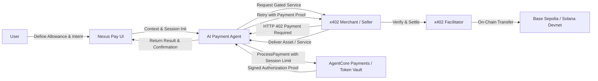
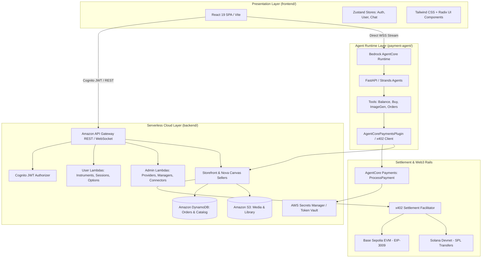
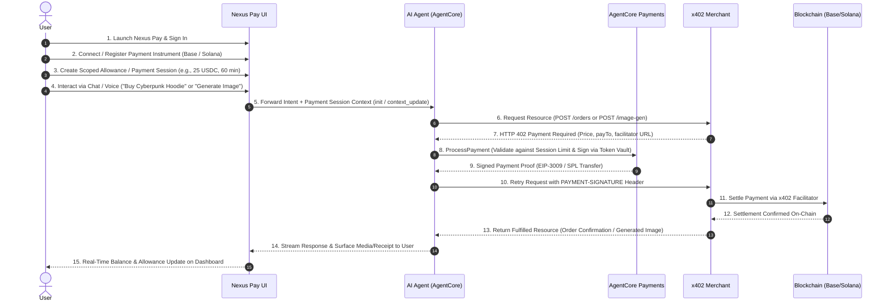

# Nexus Pay

> **Intelligent Payments. Built for Web3.**

Nexus Pay is a next-generation programmable  Web3 payment experience designed for the emerging agentic economy. It bridges autonomous AI agents and decentralized finance by providing a secure, bounded execution layer for Web3 payments—combining conversational AI interfaces, multi-chain payment instruments, programmable spending allowances, HTTP 402 payment protocol integration, and AWS Bedrock AgentCore payment infrastructure.

---

## Why Nexus Pay?

As autonomous AI agents evolve from conversational assistants to economic actors capable of executing tasks, purchasing digital assets, subscribing to APIs, and ordering services, existing payment systems present two critical bottlenecks:

1. **Fragmented & Manual Web3 Payments:** Traditional Web3 transactions require manual wallet confirmations, seed phrase exposures, and complex network-specific signing workflows that break autonomous agent execution.
2. **Unbounded Agent Risk:** Giving an autonomous agent unrestricted access to a raw private key or hot wallet creates catastrophic financial risk. Without programmatic constraints, an hallucinating or compromised agent could drain entire treasury balances.

**Nexus Pay solves this fundamental friction** by introducing **bounded payment sessions and scoped payment instruments**. Users delegate strictly defined spending limits, token budgets, and time-based expiries to AI agents, enabling autonomous pay-per-use commerce while guaranteeing cryptographic control and financial safety.

---

## What We Built

Nexus Pay delivers a complete, end-to-end interface and runtime architecture for agent-driven Web3 commerce:

- **Unified Web3 Payment Portal:** A responsive single-page application where users manage embedded wallets, monitor live balances across EVM and Solana, define spending allowances, inspect transaction histories, and simulate direct payments.
- **Conversational AI Payment Agent:** An autonomous assistant (powered by Anthropic Claude and Amazon Nova via Bedrock AgentCore and Strands Agents) capable of browsing merchant catalogs, generating paid digital assets, and executing purchases on behalf of the user within session limits.
- **x402 Micropayment Protocol Integration:** Native handling of HTTP `402 Payment Required` headers, allowing the agent to negotiate prices in USDC, generate signed payment authorizations (EIP-3009 on EVM, SPL token transfers on Solana), settle via an x402 facilitator, and receive gated resources automatically.
- **Dual-Mode Architecture:** A standalone **Local Demo Mode** for immediate evaluation and UI walkthroughs without cloud dependencies, seamlessly transitioning to a **Connected AWS Mode** with full cloud serverless and AgentCore infrastructure.

---

## Key Features

| Feature | Description |
|---|---|
| **AI Payment Agent** | Conversational agent supporting real-time streaming text and voice interactions, equipped with specialized payment and commerce tools (`check_balance`, `list_products`, `buy_product`, `generate_image`, `list_orders`, `cancel_order`). |
| **Web3 Wallets & Payment Instruments** | Multi-chain support for **Base Sepolia** (EVM / EIP-3009) and **Solana Devnet** (SPL tokens), backed by Coinbase CDP and Stripe/Privy embedded credential providers. |
| **Nexus Allowances & Payment Sessions** | Programmable spending caps with maximum spend amounts (USDC) and time-based session expiries (15 to 480 minutes) that strictly constrain agent spending. |
| **Payment Dashboard** | Real-time overview of active payment instruments, allocated allowance utilization, recent transactions, and quick action shortcuts. |
| **Simulated Pay & Transfer** | Interactive payment flow allowing users to test payment workflows, recipient addressing, amount inputs, and transaction confirmations. |
| **Payment History & Receipts** | Transparent audit log of historical transactions, status badges (`COMPLETED`, `PENDING`, `REFUNDED`), network identifiers, and order references. |
| **x402 Payment Infrastructure** | Automated HTTP 402 interception and proof injection (`AgentCorePaymentsPlugin`) for pay-per-request seller APIs (AI image generation, digital storefront goods). |
| **AWS AgentCore Integration** | Serverless architecture leveraging Amazon Bedrock AgentCore Runtime, AgentCore Payments (`ProcessPayment`), Amazon Cognito auth, API Gateway, DynamoDB, S3, and Secrets Manager. |
| **Local Demo Mode** | Instant out-of-the-box local testing experience with seeded mock wallets, active sessions, transaction history, and simulated state progression. |

---

## How It Works

Nexus Pay supports two distinct operational modes: **Local Demo Mode** for client-side evaluation and **Connected AWS Mode** for real cloud/on-chain execution.

### High-Level Payment Lifecycle



### Local Demo Mode vs. AWS Connected Mode

```mermaid
flowchart TD
    subgraph Local_Mode["Local Demo Mode (Out of the Box)"]
        UI_L[Nexus Pay React UI] --> Store_L[Zustand In-Memory State]
        Store_L --> Sim_L[Simulated Payment Progression]
        Sim_L --> Seed_L[Seeded Instruments, Sessions & History]
        note1[No real funds moved • No AWS credentials required]
    end

    subgraph AWS_Mode["Connected AWS Mode (Deployed Infrastructure)"]
        UI_C[Nexus Pay React UI] --> Cognito[Amazon Cognito Auth]
        Cognito --> APIGW[Amazon API Gateway]
        APIGW --> Lambdas[Serverless Lambdas]
        APIGW --> ACR[Bedrock AgentCore Runtime]
        ACR --> Agent[Containerized Payment Agent]
        Agent --> ACP[Bedrock AgentCore Payments]
        ACP --> x402[x402 Facilitator]
        x402 --> Chains[Base Sepolia / Solana Devnet]
    end
```



---

## Architecture

Nexus Pay is structured into modular layers spanning presentation, orchestration, serverless backend, agent runtime, and settlement rails.



### Component Breakdown

1. **Frontend (`frontend/`):** React 19 single-page application built with TypeScript, Vite, Tailwind CSS v4, Radix UI primitives, and Zustand. Features seamless authentication switching (Cognito vs. mock local evaluator), live WebSocket agent streaming with audio/text support, wallet management, allowance creation, and responsive analytics.
2. **Backend Serverless Layer (`backend/`):** AWS CDK TypeScript infrastructure provisioning Amazon Cognito user pools, API Gateway REST/WebSocket APIs, DynamoDB persistence tables, S3 media buckets, and Python Lambda microservices for admin and user workflows.
3. **Payment Agent (`payment-agent/`):** Containerized Python service powered by the Strands Agents framework and FastAPI, hosted on Amazon Bedrock AgentCore Runtime. It orchestrates text/voice dialogues using Claude Sonnet and Amazon Nova Sonic, managing tools and executing x402-gated transactions.
4. **AgentCore Payments & x402 Layer:** Executes cryptographic signing via AWS Token Vault and submits authorization proofs to the x402 facilitator for on-chain settlement across Base Sepolia and Solana Devnet.

For in-depth specifications, refer to our dedicated documentation:
- [docs/ARCHITECTURE.md](docs/ARCHITECTURE.md) — Detailed architectural layers and deployment boundaries
- [docs/SYSTEM_DESIGN.md](docs/SYSTEM_DESIGN.md) — System design principles, store architecture, and APIs
- [docs/AGENT_FLOW.md](docs/AGENT_FLOW.md) — Agent lifecycle, WebSocket protocols, and tool schemas
- [docs/PAYMENT_FLOW.md](docs/PAYMENT_FLOW.md) — Payment state machines, x402 loop, and settlement specs
- [docs/DATA_SCHEMA.md](docs/DATA_SCHEMA.md) — Complete TypeScript and backend data schemas
- [docs/API_REFERENCE.md](docs/API_REFERENCE.md) — Comprehensive REST and WebSocket API endpoints

---

## User Flow



---

## Local Demo

You can run and evaluate the complete Nexus Pay frontend locally in **Local Demo Mode** with zero cloud setup or AWS credentials.

```

### Navigating the Demo Mode

1. **Sign-In Screen:** On the login page, click the prominent banner **"Explore Nexus Pay (Local Demo Mode)"** or use the **"Mock User"** / **"Mock Admin"** buttons under the local development divider.
2. **Dashboard (`/user`):** Inspect seeded wallet balances, active allowance limits, recent simulated transactions, and quick action tiles.
3. **Wallets (`/user/wallets`):** View pre-configured Base Sepolia and Solana Devnet embedded crypto wallets with live status badges.
4. **Allowances (`/user/allowances`):** Create new programmatic spending sessions specifying maximum spend amounts in USDC and expiry durations.
5. **AI Agent (`/user/agent`):** Test the interactive conversational interface with pre-loaded suggestion prompts and contextual controls.
6. **Simulated Pay (`/user/pay`):** Test recipient address validation, amount inputs, and simulated payment dispatch.
7. **History (`/user/history`):** Review chronological payment logs and audit details.

> [!NOTE]
> **Local Demo Limitation:** All payment progressions and balance adjustments in Local Demo Mode are simulated in local state for UI/UX demonstration. **No real blockchain transactions or funds move** in local demo mode.

---

## AWS Integration

When deployed to an active AWS environment, Nexus Pay provisions a fully managed serverless infrastructure for production agentic commerce:

```
AWS Cloud
├── Amazon Cognito           ── User authentication, JWT issuance & RBAC groups (admin/user)
├── Amazon API Gateway       ── Secure REST & WebSocket endpoints with JWT Authorizers
├── AWS Lambda               ── Serverless Python microservices for admin and user workflows
├── AWS Secrets Manager      ── Secure credential storage for Coinbase CDP & Privy API keys
├── Amazon DynamoDB          ── Persistent storage for merchant products, orders, and seller configs
├── Amazon S3                ── Secure asset storage for generated media and digital library goods
├── Amazon Bedrock AgentCore ── Agent runtime environment with Claude Sonnet & Amazon Nova
├── AgentCore Payments       ── Token Vault signing & ProcessPayment authorization service
└── AWS CodeBuild / ECR      ── Containerized build and deployment pipeline for the agent image

*Note: Live cloud execution requires deploying the AWS CDK stack (`backend/`) and configuring the necessary credential providers.*

---

## Tech Stack

### Frontend Application
- **Core Framework:** React 19 (`19.2.4`), TypeScript (`5.9.3`), Vite (`7.3.6`)
- **Styling & UI:** Tailwind CSS (`4.2.1`), Radix UI Primitives, Lucide Icons (`0.577.0`), Recharts (`3.8.0`)
- **State Management:** Zustand (`5.0.11`) with local persistence and demo fallbacks
- **Web3 & Auth SDKs:** `@privy-io/react-auth` (`3.32.2`), `amazon-cognito-identity-js` (`6.3.18`)

### Payment Agent
- **Runtime:** Python 3.11+, FastAPI, Uvicorn
- **Agent Orchestration:** Strands Agents framework
- **Models:** Anthropic Claude 3.5 Sonnet (Text & Tool Reasoning), Amazon Nova Sonic (Bidirectional Voice), Amazon Nova Canvas (Image Generation)
- **Protocol Client:** `AgentCorePaymentsPlugin`, `httpx`

### Cloud & Backend (CDK)
- **Infrastructure as Code:** AWS CDK v2 (TypeScript)
- **Serverless Compute:** AWS Lambda (Python 3.11 runtimes)
- **Databases & Storage:** Amazon DynamoDB, Amazon S3
- **Security & Identity:** Amazon Cognito, AWS Secrets Manager, IAM least-privilege roles

### Web3 & Settlement Protocols
- **Networks:** Base Sepolia (EVM testnet), Solana Devnet
- **Currency:** Testnet USDC
- **Micropayment Protocol:** x402 open payment protocol
- **Signature Schemes:** EIP-3009 (`ReceiveWithAuthorization`) on EVM, SPL Token Transfer on Solana

---

## Documentation

For comprehensive technical deep-dives into each subsystem, consult our dedicated technical documentation:

| Document | Focus Area | Description |
|---|---|---|
| [**Architecture**](docs/ARCHITECTURE.md) | System Architecture | Overview of the high-level architecture, frontend/backend separation, and deployment boundaries. |
| [**System Design**](docs/SYSTEM_DESIGN.md) | Technical Design | Multi-tier system design, state management stores, and connection handling. |
| [**Agent Flow**](docs/AGENT_FLOW.md) | Agent Orchestration | WebSocket message protocol, Strands tool definitions, context updating, and voice streaming. |
| [**Payment Flow**](docs/PAYMENT_FLOW.md) | Payment Mechanics | Detailed breakdown of the x402 payment loop, session bounding, and settlement mechanics. |
| [**Data Schema**](docs/DATA_SCHEMA.md) | Data Contracts | Canonical schemas for Credential Providers, Payment Managers, Instruments, and Sessions. |
| [**API Reference**](docs/API_REFERENCE.md) | API Catalog | Complete reference of Admin, User, Storefront, and Seller REST and WebSocket endpoints. |

---

## Security & Trust Model

Nexus Pay is built around defense-in-depth principles to ensure safe autonomous agent operations:

1. **Bounded Execution via Payment Sessions:** The AI agent never receives broad or permanent access to wallet balances. It can only spend within the explicit currency, maximum spend cap, and time expiration of an active `PaymentSession`.
2. **Key Vault Isolation:** Private keys and signing secrets remain isolated in secure credential vaults (AWS Secrets Manager / Coinbase CDP / Privy). Neither the browser client nor the language model ever touches raw private keys.
3. **Role-Based Access Control:** Amazon Cognito user pools enforce strict segregation between administrative control planes (`/admin/*`) and end-user payment flows (`/user/*`).
4. **Idempotent x402 Verification:** Merchant orders and refunds require strict verify-before-fulfill guarantees and nonce checks to prevent replay attacks and double-spending.
5. **Clear Separation of Local Demo:** The local development mode runs entirely on mock client-side state, ensuring no accidental calls to live payment rails without explicit configuration.

---

## Current Status

- **Local Demo Mode:** Fully functional and interactive. Evaluators can launch the Vite application, sign in with demo credentials, explore all dashboard metrics, create allowances, simulate payments, and inspect the complete UI/UX without AWS setup.
- **Connected Cloud Capabilities:** CDK infrastructure definitions, Lambda handlers, FastAPI agent services, and x402 settlement logic are fully implemented in the repository and ready to be deployed to an AWS environment with configured Coinbase CDP / Privy credentials.

---

## Roadmap

- [x] Responsive Web3 Payment Dashboard & Allowances Manager (React 19)
- [x] Multi-chain payment instrument schema (Base Sepolia & Solana Devnet)
- [x] Containerized AI Payment Agent with Strands Agents & x402 interception
- [x] AWS CDK serverless backend infrastructure & Cognito authentication
- [x] Local Demo Mode with mock state for instant hackathon evaluation
- [ ] Multi-token support beyond USDC (native ETH, SOL, ERC-20 tokens)
- [ ] Decentralized session policy registry via smart contract hooks
- [ ] Subscriptions & recurring automated allowance refills for long-running agents

---

## 👥 Team Titans

**Team Titans** — built with ❤️ for the NTU InnovateX Hackathon 2026.

### Team Members

- **Lakshya Dogra** — Student
- **Vishesh Nigam** — Student
- **Aditya Agrawal** — Student

---

## 🚀 Explore Nexus Pay

**[🌐 Try the Live Demo](https://nexuspay-ai.netlify.app)**
**[🎥 Watch the Demo Video](https://drive.google.com/file/d/1cPTpWunZ1gzjIm-Zo69YA7xyDCf70Jry/view?usp=sharing)**
**[💻 View the Source Code](https://github.com/lakshya0101/Nexus-Pay)**

> **Autonomy without giving up control.**

---

## Submission Note

Nexus Pay demonstrates a **production-oriented blueprint for agentic Web3 payments**, combining conversational AI, programmatically bounded payment sessions, the open **x402 payment standard**, and **Amazon Bedrock AgentCore** infrastructure.

By enforcing explicit spending allowances and payment boundaries, Nexus Pay enables autonomous agents to execute payment actions while keeping users in control of how, when, and how much an agent can spend.

---

<p align="center">
  © 2026 Team Titans · Nexus Pay
  <br>
  <em>Autonomy without giving up control.</em>
</p>
