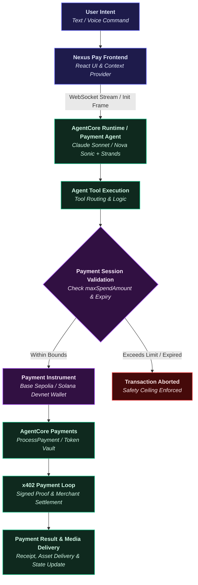

# Nexus Pay — AI Agent Flow Specification

> **Orchestration, Protocol Boundaries, and Bounded Payment Context for Agentic Commerce**

The Nexus Pay agent architecture connects natural-language user intent with cryptographically bounded payment infrastructure.

The core architectural principle of Nexus Pay is:

> **AI agents can autonomously negotiate and assist with payment actions, while Payment Instruments and Payment Sessions strictly enforce the spending limits and execution boundaries.**

---

## 1. High-Level Agent & Payment Flow

The following flowchart illustrates how conversational intent transitions through the agent runtime and spending controls into payment execution:



---

## 2. Agent Tools & Capabilities

The containerized payment agent implements six specialized tools built on the Strands Agents framework:

| Tool / Component | Purpose | Payment Context & Safety |
|---|---|---|
| `check_balance` | Query live balances of the registered payment instrument via `GetPaymentInstrumentBalance`. | Read-only. Requires `paymentInstrumentId` and `paymentManagerArn`. |
| `list_products` | Browse the merchant catalog and retrieve available physical and digital goods. | Free. Does not require payment proof or spending session deduction. |
| `buy_product` | Purchase physical or digital assets with automatic HTTP 402 handling and fulfillment. | **Paid.** Deducts price from active `PaymentSession`; signs proof via `PaymentInstrument`. |
| `generate_image` | Request AI image synthesis powered by Amazon Nova Canvas behind x402 micropayment gating. | **Paid.** Intercepts 402, executes `ProcessPayment`, and uploads 30-min media artifact. |
| `list_orders` | Retrieve purchase history and download access records for the authenticated buyer. | Read-only. Filtered by `buyerUserId` DynamoDB index. |
| `cancel_order` | Initiate consume-gated order refunds and restock merchant inventory. | **Refund.** Originated by seller using a per-refund capped spending session. |

---

## 3. The x402 Autonomous Payment Loop

When an agent tool encounters a paid merchant resource, the `AgentCorePaymentsPlugin` intercepts HTTP 402 status codes and executes payment proof generation without manual agent assembly:

```mermaid
sequenceDiagram
    autonumber
    actor User
    participant Frontend as Nexus Pay UI
    participant Agent as Payment Agent (Strands)
    participant Merchant as x402 Merchant / Seller
    participant ACP as AgentCore Payments (Token Vault)
    participant Facilitator as x402 Facilitator
    participant Blockchain as Base Sepolia / Solana

    User->>Frontend: Send Prompt ("Generate image of Cyberpunk City")
    Frontend->>Agent: Forward Intent + Session Context
    Agent->>Merchant: POST /image-gen (Initial request without proof)
    Merchant-->>Agent: HTTP 402 Payment Required (Price, payTo address, facilitator URL)

    rect rgb(30, 27, 75)
        Note over Agent,ACP: AgentCorePaymentsPlugin Interception
        Agent->>ACP: ProcessPayment(PaymentSession, Instrument, 402 Terms)
        ACP->>ACP: Validate Spend Limit & Expiry
        ACP->>ACP: Sign Payload via Token Vault (EIP-3009 / SPL Token)
        ACP-->>Agent: Return Signed Proof (PROOF_GENERATED)
    end

    Agent->>Merchant: Retry POST /image-gen (Header: PAYMENT-SIGNATURE)
    Merchant->>Facilitator: Verify Signature & Terms
    Facilitator->>Blockchain: Post On-Chain Settlement Transfer
    Blockchain-->>Facilitator: Settlement Confirmed
    Facilitator-->>Merchant: Verification & Settlement OK
    Merchant-->>Agent: 200 OK + Generated Resource Base64
    Agent->>Frontend: Stream Completion + Media URL + Receipt
    Frontend-->>User: Display Image & Update Real-Time Session Allowance
```



---

## 4. Streaming & Communication Protocols

### 4.1 Connection Establishment
1. The frontend invokes `GET /user/agent/ws-url` to obtain an ephemeral, SigV4-presigned WebSocket URL from the backend Lambda.
2. The browser connects directly to Amazon Bedrock AgentCore Runtime over secure WebSocket (`WSS`).

### 4.2 Initialization Frame (`init`)
Upon connection, the client transmits an `init` frame containing the active execution context:
```json
{
  "type": "init",
  "userId": "user_cognito_or_demo",
  "mode": "text",
  "paymentContext": {
    "paymentManagerArn": "arn:aws:bedrock-agentcore:...",
    "paymentConnectorId": "conn_coinbase_01",
    "paymentInstrumentId": "pi_evm_nexus_01",
    "paymentSessionId": "ps_nexus_allowance_daily",
    "network": "ETHEREUM",
    "walletAddress": "0x1234...abcd"
  }
}
```

### 4.3 Context Updates (`context_update`)
Users can switch payment instruments, active sessions, or blockchain networks dynamically from the UI. The frontend dispatches a `context_update` frame over the open socket, eliminating reconnection latency.

### 4.4 Stream Event Types
- `text_stream`: Real-time token streaming from Claude Sonnet.
- `text_done`: Text generation lifecycle completion marker.
- `tool_use`: Live indicator of tool invocation and execution status.
- `media`: Encapsulates generated image links (30-minute S3 presigned URL + library reference) and audio payloads.

### 4.5 Bidirectional Voice Stream
In voice mode, the client streams 16 kHz raw PCM audio directly to the agent runtime powered by Amazon Nova Sonic, receiving incremental transcription and low-latency audio responses.

---

## 5. Security & Safety Boundaries

The agent operates strictly within programmatic financial constraints:
- **No Direct Key Access:** Private keys never enter the model context or agent container; cryptographic signatures are produced exclusively by the AgentCore Token Vault.
- **Session Spending Ceilings:** Every payment request is checked against `maxSpendAmount` and rejected immediately if the threshold is exceeded.
- **Time Expiration:** Sessions expire automatically after their configured duration (15 to 480 minutes).

---

## 6. Execution Mode Comparison

| Capability | Local Demo Mode (`Public / Netlify`) | Connected AWS Mode (`Deployed Architecture`) |
|---|---|---|
| **WebSocket Connection** | Simulated client-side stream | Live SigV4 WSS to Bedrock AgentCore Runtime |
| **Model Reasoning** | Mock conversational state & seeded prompts | Anthropic Claude 3.5 Sonnet / Amazon Nova Sonic |
| **Tool Execution** | In-memory mock dispatch | Containerized FastAPI / Strands Agents service |
| **Payment Signature** | Client-side state simulation | AWS Token Vault cryptographic signing |
| **x402 Settlement** | Simulated payment progression | On-chain settlement via x402 Facilitator |
