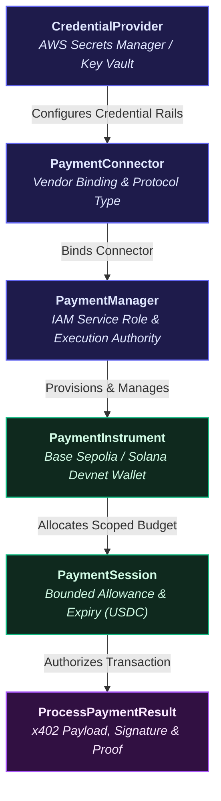

# Nexus Pay — Data Schema Specification

> **Canonical Data Models & Entity Relationship Specifications for Agentic Web3 Commerce**

This document provides the formal data dictionary and schema reference for Nexus Pay's control plane, data plane, and agent execution layers, audited against the production TypeScript models in [`frontend/src/types/index.ts`](../frontend/src/types/index.ts).

---

## Entity Relationship Architecture

The following diagram illustrates the hierarchical relationship between administrative control plane infrastructure, user-scoped data plane instruments, bounded spending allowances, and cryptographic payment execution results:

---

## 1. Supported Vendors (`Vendor`)

Nexus Pay integrates with institutional-grade embedded credential providers:

| Value | Category | Description |
|---|---|---|
| `'CoinbaseCDP'` | Embedded Wallet Provider | Email-OTP end-user UUID delegation via Coinbase Developer Platform |
| `'StripePrivy'` | Embedded Wallet Provider | Server-provisioned wallets with Privy Connect Agent session signer delegation |

---

## 2. Control Plane Models (Administrative Infrastructure)

Control plane resources manage credential vaults, IAM execution roles, and vendor connector bindings.

### 2.1 CredentialProvider (`CredentialProvider`)
Represents registered credentials stored securely in AWS Secrets Manager via the AgentCore Token Vault.

| Field | Type | Description |
|---|---|---|
| `name` | `string` | Human-readable identifier for the credential provider. |
| `credentialProviderVendor` | `string` | The vendor type (`CoinbaseCDP` or `StripePrivy`). |
| `credentialProviderArn` | `string` | Unique Amazon Resource Name (ARN) identifying the provider in AWS. |
| `providerConfigurationOutput` | `object?` | Vendor-specific key references stored in AWS Secrets Manager: |
| `↳ coinbaseCdpConfiguration.apiKeyId` | `string?` | Coinbase CDP API Key identifier. |
| `↳ coinbaseCdpConfiguration.apiKeySecretArn` | `{ secretArn: string }?` | Secrets Manager ARN holding the CDP API Key Secret. |
| `↳ coinbaseCdpConfiguration.walletSecretArn` | `{ secretArn: string }?` | Secrets Manager ARN holding the CDP Wallet Secret. |
| `↳ stripePrivyConfiguration.appId` | `string?` | Privy Application ID. |
| `↳ stripePrivyConfiguration.appSecretArn` | `{ secretArn: string }?` | Secrets Manager ARN holding the Privy App Secret. |
| `↳ stripePrivyConfiguration.authorizationId` | `string?` | Privy authorization key identifier. |
| `↳ stripePrivyConfiguration.authorizationPrivateKeyArn` | `{ secretArn: string }?` | Secrets Manager ARN holding the Privy authorization private key. |
| `status` | `string?` | Deployment status (e.g., `CREATING`, `ACTIVE`, `DELETING`). |
| `createdAt` | `string?` | ISO 8601 creation timestamp. |
| `updatedAt` | `string?` | ISO 8601 last update timestamp. |

---

### 2.2 PaymentManager (`PaymentManager`)
The root signing and execution authority configured with an AWS IAM service role.

| Field | Type | Description |
|---|---|---|
| `paymentManagerId` | `string` | Unique identifier for the payment manager. |
| `paymentManagerArn` | `string` | Amazon Resource Name (ARN) of the Payment Manager instance. |
| `name` | `string` | Name of the manager instance. |
| `description` | `string?` | Optional details describing purpose or scope. |
| `authorizerType` | `string` | Authorization model (e.g., `AWS_IAM`). |
| `roleArn` | `string` | IAM Service Role assumed by AgentCore to access Token Vault and sign payments. |
| `workloadIdentityDetails` | `{ workloadIdentityArn: string }?` | Workload identity ARN for federated authentication. |
| `status` | `string` | Operational state (`ACTIVE`, `PENDING`, etc.). |
| `createdAt` | `string?` | ISO 8601 creation timestamp. |
| `updatedAt` | `string?` | ISO 8601 last update timestamp. |

---

### 2.3 PaymentConnector (`PaymentConnector`)
Binds a Payment Manager to one or more Credential Providers to route 402 payment processing.

| Field | Type | Description |
|---|---|---|
| `paymentConnectorId` | `string` | Unique identifier for the connector. |
| `paymentManagerId` | `string` | Associated Payment Manager ID. |
| `name` | `string` | Connector display name. |
| `description` | `string?` | Optional description of the connector route. |
| `type` | `string` | Connector type matching vendor (`CoinbaseCDP` or `StripePrivy`). |
| `credentialProviderConfigurations` | `Array<object>` | Array of credential bindings (`{ coinbaseCDP: { credentialProviderArn } }` or `{ stripePrivy: { credentialProviderArn } }`). |
| `status` | `string` | Status of connector routing (`ACTIVE`, `INACTIVE`). |
| `createdAt` | `string?` | ISO 8601 creation timestamp. |
| `updatedAt` | `string?` | ISO 8601 last update timestamp. |

---

## 3. Data Plane Models (User Accounts & Payment Rails)

Data plane resources manage user-facing embedded crypto wallets, scoped spending sessions, and transaction proofs.

### 3.1 PaymentInstrument (`PaymentInstrument`)
Represents an embedded multi-chain crypto wallet assigned to a specific user on Base Sepolia or Solana Devnet.

| Field | Type | Description |
|---|---|---|
| `paymentInstrumentId` | `string` | Unique identifier for the registered payment instrument (e.g., `pi_evm_nexus_01`). |
| `paymentManagerArn` | `string` | ARN of the governing Payment Manager. |
| `paymentConnectorId` | `string` | ID of the linked Payment Connector. |
| `userId` | `string` | Unique user identifier (Cognito Subject ID or Demo User ID). |
| `paymentInstrumentType` | `string` | Type classification (`EMBEDDED_CRYPTO_WALLET` or `CRYPTO_WALLET`). |
| `paymentInstrumentDetails` | `object` | Multi-chain wallet metadata: |
| `↳ cryptoWallet.network` | `string?` | Blockchain network identifier (`ETHEREUM` or `SOLANA`). |
| `↳ cryptoWallet.walletAddress` | `string?` | On-chain public wallet address. |
| `↳ embeddedCryptoWallet.network` | `string?` | Network for embedded wallet (`ETHEREUM` for Base Sepolia, `SOLANA` for Solana Devnet). |
| `↳ embeddedCryptoWallet.walletAddress` | `string?` | Embedded wallet public key / contract address. |
| `↳ embeddedCryptoWallet.linkedAccounts` | `Array<{ email?: { emailAddress: string } }>?` | User email binding associated with the embedded credential. |
| `↳ embeddedCryptoWallet.redirectUrl` | `string?` | Coinbase Wallet Hub onboarding delegation URL (Coinbase CDP). |
| `status` | `string` | Current wallet status (`ACTIVE`, `PENDING_VERIFICATION`, `SUSPENDED`). |
| `createdAt` | `string?` | ISO 8601 creation timestamp. |
| `updatedAt` | `string?` | ISO 8601 last update timestamp. |

---

### 3.2 PaymentSession (`PaymentSession`)
Defines a bounded, time-limited spending allowance that constrains autonomous agent transactions.

| Field | Type | Description |
|---|---|---|
| `paymentSessionId` | `string` | Unique identifier for the allowance session (e.g., `ps_nexus_allowance_daily`). |
| `paymentManagerArn` | `string` | ARN of the governing Payment Manager. |
| `userId` | `string` | Owner user ID for the session. |
| `limits.maxSpendAmount.value` | `string` | Hard ceiling on cumulative agent spending (e.g., `"50.00"`). |
| `limits.maxSpendAmount.currency` | `string` | Denominated currency code (`"USDC"`). |
| `expiryTimeInMinutes` | `number` | Time-to-live for the session (15 to 480 minutes). |
| `currentSpendAmount.value` | `string?` | Real-time cumulative amount spent by the agent (e.g., `"12.50"`). |
| `currentSpendAmount.currency` | `string?` | Currency of current spend (`"USDC"`). |
| `status` | `string?` | Session status (`ACTIVE`, `EXPIRED`, `DEPLETED`, `TERMINATED`). |
| `createdAt` | `string?` | ISO 8601 creation timestamp. |
| `updatedAt` | `string?` | ISO 8601 last update timestamp. |

---

### 3.3 ProcessPaymentResult (`ProcessPaymentResult`)
The cryptographic proof and authorization output generated upon successful x402 payment execution.

| Field | Type | Description |
|---|---|---|
| `processPaymentId` | `string` | Unique execution tracking identifier (e.g., `tx_nexus_demo_001`). |
| `paymentManagerArn` | `string` | ARN of the executing Payment Manager. |
| `paymentSessionId` | `string` | Session under which the payment was deducted. |
| `paymentInstrumentId` | `string` | Instrument (wallet) used as the payer funding source. |
| `paymentType` | `string` | Payment protocol (`CRYPTO_X402`). |
| `status` | `string` | Transaction status (`COMPLETED`, `PENDING`, `FAILED`, `REFUNDED`). |
| `paymentOutput` | `object?` | Cryptographic signature and authorization container: |
| `↳ cryptoX402.version` | `string?` | x402 protocol specification version (`"1.0"`). |
| `↳ cryptoX402.payload.authorization` | `Record<string, string>?` | Protocol authorization payload (e.g., EIP-3009 terms, nonces, timestamps). |
| `↳ cryptoX402.payload.signature` | `string?` | Cryptographic signature generated via Token Vault for on-chain settlement. |
| `createdAt` | `string?` | ISO 8601 creation timestamp. |

---

## 4. Local Demo Mode vs. Real On-Chain Settlement

Nexus Pay maintains a strict boundary between client-side simulation and live cloud/blockchain execution:

| Dimension | Local Demo Mode (`Evaluator State`) | Connected AWS Mode (`Live Deployment`) |
|---|---|---|
| **Identity & Authentication** | Mock In-Memory Store (`demo@nexuspay.io`) | Amazon Cognito User Pool JWT Bearer Tokens |
| **Credential Storage** | Seeded Client-Side Records | AWS Secrets Manager + AgentCore Token Vault |
| **Signing Authority** | Simulated Frontend Dispatch | `bedrock-agentcore` IAM Service Role |
| **Transaction Records** | In-Memory Zustand State Store | Amazon DynamoDB Orders Table + AWS CloudWatch Spans |
| **Settlement Rail** | Simulated State Progression | x402 Facilitator + Base Sepolia / Solana Devnet |
| **Real Funds Moved** | **No funds transferred** (Safe for evaluation) | On-Chain Testnet USDC Transferred |

> [!NOTE]
> All local demo payments and allowance deductions update client-side Zustand stores for complete UX evaluation. Live cryptographic signatures and on-chain settlements require deployed AWS CDK infrastructure and connected credential providers.
