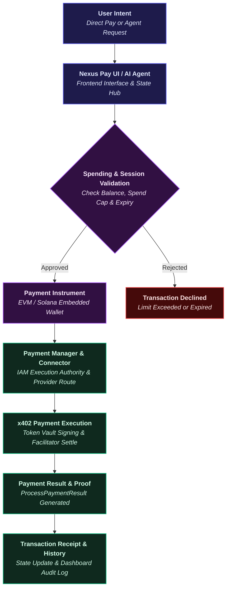

# Nexus Pay — Payment Flow Specification

> **End-to-End Payment Lifecycle, x402 Negotiation, and Bounded Settlement Architecture**

Nexus Pay establishes a dual-mode payment architecture: a standalone **Local Demo Mode** for zero-friction client-side evaluation and a **Connected AWS Mode** for live cloud and blockchain payment execution.

---

## 1. End-to-End Payment Lifecycle

The following diagram illustrates how user payment intent flows from the interface through session validation, cryptographic signing, x402 settlement, and receipt generation:

---

## 2. Payment Lifecycle Stages

The complete lifecycle across Nexus Pay components progresses through six structured stages:

| Stage | Component | Action | Result |
|---|---|---|---|
| **1. Intent & Context** | User / Nexus Pay Frontend | User initiates a direct transfer (`/user/pay`) or tasks the AI agent with a purchase. | Active `PaymentSession` and `PaymentInstrument` context are attached to the request. |
| **2. Terms Negotiation** | AI Agent / Merchant Service | Agent requests a paid resource without proof (`POST /orders` or `POST /image-gen`). | Merchant returns HTTP `402 Payment Required` with price in USDC, recipient `payTo`, and facilitator URL. |
| **3. Spending Validation** | Payment Session (`PaymentSession`) | System checks payment amount against active session `maxSpendAmount` and TTL expiry. | Request is authorized if spend ceiling is preserved; rejected if limit is exceeded. |
| **4. Cryptographic Proof** | AgentCore Payments / Token Vault | Backend invokes `ProcessPayment` API to generate signed transfer payload. | EIP-3009 authorization (Base Sepolia) or SPL transfer signature (Solana Devnet) is minted without exposing private keys. |
| **5. Settlement Execution** | x402 Facilitator / Blockchain | Merchant retries request with `PAYMENT-SIGNATURE` and submits proof to facilitator. | On-chain settlement transfer is executed on Base Sepolia or Solana Devnet. |
| **6. Fulfillment & Audit** | Merchant / Client Store | Merchant fulfills order (releases asset/image); frontend logs transaction receipt. | Order marked `CONFIRMED`, session allowance decremented, and transaction recorded in history. |

---

## 3. The x402 Protocol Loop Sequence

```mermaid
sequenceDiagram
    autonumber
    actor User
    participant Frontend as Nexus Pay UI
    participant Agent as AI Payment Agent
    participant Seller as x402 Merchant / Seller
    participant ACP as AgentCore Payments
    participant Facilitator as x402 Facilitator
    participant Chain as Base Sepolia / Solana

    User->>Frontend: Trigger Payment / Buy Request
    Frontend->>Agent: Forward Request + Session Allowance Context
    Agent->>Seller: Request Resource (No Proof)
    Seller-->>Agent: HTTP 402 Payment Required (Price, payTo, Facilitator)

    rect rgb(30, 27, 75)
        Note over Agent,ACP: Cryptographic Proof Generation
        Agent->>ACP: ProcessPayment(SessionId, InstrumentId, Terms)
        ACP->>ACP: Verify Bounded Limits (USDC)
        ACP->>ACP: Sign via Token Vault (EIP-3009 / SPL)
        ACP-->>Agent: Signed Proof (PAYMENT-SIGNATURE)
    end

    Agent->>Seller: Retry Request with PAYMENT-SIGNATURE
    Seller->>Facilitator: Verify Signature & Terms
    Facilitator->>Chain: Post Settlement Transaction
    Chain-->>Facilitator: On-Chain Transfer Confirmed
    Facilitator-->>Seller: Settlement Success
    Seller-->>Agent: 200 OK + Fulfill Asset / Resource
    Agent->>Frontend: Deliver Result & Receipt Details
    Frontend-->>User: Display Confirmation & Updated Allowance Balance
```

---

## 4. Demo vs Connected Execution

Nexus Pay explicitly separates simulated evaluation from live infrastructure execution:

| Dimension | Netlify Public Demo (`Local Demo Mode`) | Connected AWS Mode (`Live Deployment`) |
|---|---|---|
| **Execution Environment** | Client-side React application on Netlify / localhost | AWS Serverless Stack + Bedrock AgentCore Runtime |
| **Authentication** | In-memory mock evaluator profile (`demo@nexuspay.io`) | Amazon Cognito User Pool JWT Bearer authentication |
| **Payment Progression** | In-memory Zustand state mutation | AWS Lambda microservices + `ProcessPayment` API |
| **Wallet & Signing** | Seeded demo instruments and mock addresses | Coinbase CDP / Stripe Privy via AWS Secrets Manager |
| **On-Chain Settlement** | **Simulated** — No real funds or testnet gas consumed | **Real Testnet Settlement** on Base Sepolia / Solana Devnet |
| **User Notice** | *"Demo Payment Simulated — no real funds were transferred."* | Live transaction hash & on-chain receipt emitted |

---

## 5. Local `/user/pay` Simulation

The local Pay page (`/user/pay`) is designed to validate the end-to-end user experience, form validations, network selection, and receipt rendering without requiring live blockchain gas or deployed cloud infrastructure:

> **Demo Payment Simulated — no real funds were transferred.**

All simulated payments generate local transaction entries stored in Zustand state, immediately updating the active allowance charts and transaction history on the Dashboard.

---

## 6. Real Settlement Requirements

To execute live on-chain x402 settlements:
1. Deploy the AWS CDK infrastructure stack (`backend/`).
2. Configure Amazon Cognito user pools and API Gateway endpoints.
3. Provision valid credential providers (Coinbase CDP API keys or Stripe/Privy credentials) in the AgentCore Token Vault.
4. Fund the registered payment instruments with testnet USDC on Base Sepolia or Solana Devnet.
