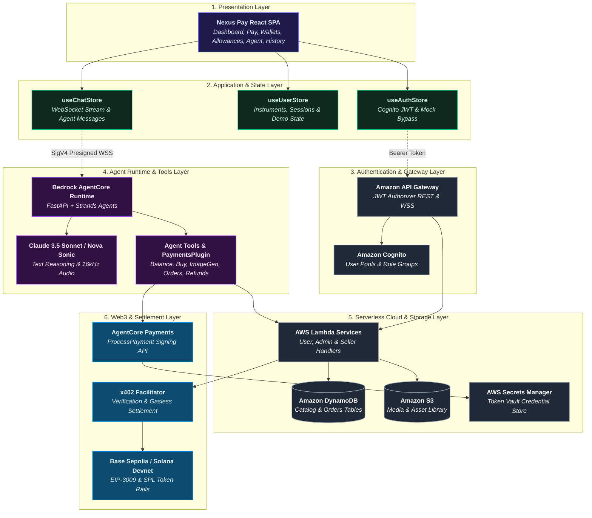

# Nexus Pay — System Design Specification

> **Architectural Layers, Multi-Tier Component Topology, and Execution Boundary Separation**

## 1. System Design Goals

Nexus Pay is architected to decouple the user-facing product experience from complex payment and cryptographic infrastructure. This ensures end users receive an intuitive, responsive Web3 payment interface while autonomous AI agents operate strictly within explicit, programmatically bounded spending allowances.

---

## 2. High-Level Architecture Topology

The following diagram outlines the layered architecture spanning client presentation, local state orchestration, serverless cloud backends, agent runtimes, and Web3 settlement rails:



---

## 3. System Components & Technology Mapping

Every component across the Nexus Pay repository maps directly to specific functional responsibilities:

| Component | Technology | Responsibility |
|---|---|---|
| **Frontend Application** | React 19, TypeScript, Vite, Tailwind CSS v4, Radix UI | Responsive single-page application providing user dashboards, allowance management, wallet registries, and conversational interfaces. |
| **State Management** | Zustand (`5.0.11`) | Manages client-side stores (`useAuthStore`, `useUserStore`, `useChatStore`) with local demo seed data and simulated state progression. |
| **Authentication** | Amazon Cognito / Mock Bypass | User authentication, JWT issuance, group-based role segregation (`admin`/`user`), and local evaluator demo bypass. |
| **API Gateway & Routing** | Amazon API Gateway (REST & WebSocket) | Secure API routing with Cognito JWT authorizers and WebSocket connection minting. |
| **Serverless Compute** | AWS Lambda (Python 3.11 runtimes) | Microservices executing admin control plane operations, user payment discovery, storefront catalog lookups, and order processing. |
| **Payment Agent Service** | FastAPI, Uvicorn, Strands Agents | Containerized AI agent service managing text/voice dialogues and invoking specialized commerce tools. |
| **AI Models** | Anthropic Claude 3.5 Sonnet & Amazon Nova | Text reasoning, multi-turn tool planning, Nova Sonic voice processing, and Nova Canvas image synthesis. |
| **Payment Signing Engine** | Amazon Bedrock AgentCore Payments | Intercepts HTTP 402 terms, verifies session bounds, and executes cryptographic signing via Token Vault. |
| **Credential Storage** | AWS Secrets Manager / Token Vault | Securely stores Coinbase CDP API keys and Privy credentials without exposing private keys to client or model. |
| **Persistence & Storage** | Amazon DynamoDB & Amazon S3 | DynamoDB stores product catalogs, order records, and seller configurations; S3 stores temporary media and persistent user asset libraries. |
| **Settlement Rails** | x402 Protocol & Multi-Chain Rails | Standardized HTTP 402 payment protocol with on-chain settlement on Base Sepolia (EIP-3009) and Solana Devnet (SPL tokens). |

---

## 4. Architectural Layers

### 4.1 Presentation Layer
Built with React 19 and Tailwind CSS, the presentation layer delivers dedicated views:
- `/user` — Overview Dashboard with wallet balances, allowance usage, and transaction summaries.
- `/user/pay` — Direct payment and transfer interface.
- `/user/wallets` — Multi-chain payment instrument management (Base Sepolia & Solana Devnet).
- `/user/agent` — Conversational AI agent interface with real-time text/voice interaction.
- `/user/allowances` — Programmable spending session configuration (USDC caps & TTL expiries).
- `/user/history` — Comprehensive audit log and receipts.
- `/admin/*` — Control plane management for credential providers, payment managers, connectors, and sellers.

### 4.2 State Management Layer
- `useAuthStore`: Coordinates Cognito authentication tokens, sign-in/up lifecycles, and mock local demo bypasses.
- `useUserStore`: Maintains active payment instruments, allocated spending sessions, and transaction history with seeded fallbacks.
- `useChatStore`: Manages streaming agent messages, tool execution statuses, media events, and voice interaction state.

### 4.3 Agent Communication & Protocol
1. The frontend requests an ephemeral signed WebSocket stream URL via `GET /user/agent/ws-url`.
2. The client transmits an `init` frame containing the user ID, selected payment instrument, active session limit, and network.
3. Subsequent `context_update` frames rebind active session parameters dynamically without disconnecting.

### 4.4 Payment Context & Safety Bounding
Autonomous transactions require an active `PaymentSession`. The session enforces:
- `maxSpendAmount`: Hard cap on total spending denominated in USDC.
- `expiryTimeInMinutes`: Strict time-to-live after which all agent spending is disabled.
- `currentSpendAmount`: Monotonically updated accumulator tracking real-time agent spend.

---

## 5. Local Demo vs. Connected AWS Architecture

Nexus Pay is engineered with clear architectural boundaries between local evaluation and production cloud deployment:

### Local Demo Architecture (`Public Netlify Deployment`)
In Local Demo Mode, Nexus Pay operates as a standalone client-side system:
```text
Browser ──> Nexus Pay UI ──> Zustand Demo State ──> Simulated Payment Progression
```
- **No AWS Credentials Required:** Runs cleanly on Netlify or local development servers.
- **Evaluator Access:** One-click login via *"Explore Nexus Pay (Local Demo Mode)"* or mock user/admin buttons.
- **Simulated Progression:** Payments update local state and display confirmation receipts without moving real funds.

### Connected AWS Architecture (`Deployed Infrastructure`)
When the AWS CDK stack and environment variables are deployed:
```text
Browser ──> Cognito / API Gateway ──> Lambda / AgentCore Runtime
        ──> Payment Agent ──> AgentCore Payments ──> x402 Facilitator ──> Blockchain
```
- **Live Authentication:** Verified against Amazon Cognito user pools.
- **Real-Time Agent Streams:** Direct WebSocket streaming to Bedrock AgentCore Runtime.
- **Cryptographic Signing:** AWS Token Vault signs EIP-3009 (Base Sepolia) or SPL transfer (Solana Devnet) authorizations.
- **On-Chain Settlement:** Settled via the x402 facilitator on connected testnets.
